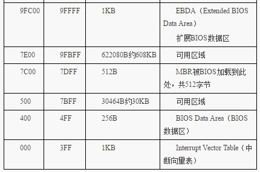

## 编写主引导程序，运行最基础的操作系统，直接实践

### mbr.S文件编写，编译和磁盘文件创建

Linux确保可以汇编（安装nasm），新建一个空目录，包含mbr.S和Makefile
代码见code/文件夹

```
$make build
$make image
```

这样可以生成一个镜像文件(注意观察文件大小)


查看镜像文件内容


### windows下在VMware虚拟机上运行OS

需要使用软盘


运行图


### 知识问题总结

* 基础知识

汇编基础

8086 16位CPU寄存器，地址总线（20根）

实模式内存地址访问（段地址：偏移）

* 实模式下1MB内存布局

http://book.51cto.com/art/201604/509566.htm





* 载入内存的理解

    1. 程序被加载器（软件或硬件）加载到内存的某个区域

    2. CPU的cs:ip寄存器被指向这个程序的起始地址

* 内存和总线

    1. DRAM是插在主板上的内存条，这种动态随机访问内存需要定期刷新，其电容小，易漏电，需要补电，即数据是可擦除的；

    2. 插在主板上的内存条需要通过地址总线访问（地址总线条数，决定了可以访问到的物理内存的大小）

    3. CPU访问一个地址，是总线来做映射的，相当于给地址分配一个存储单元，这个存储单元会落在某个rom中，某个外设的内存中，物理内存条上。
    
* BIOS加载

    1. BIOS是一个软件，由一个硬件加载，这个硬件是一个只读存储器ROM(只读存储器是不可擦除的，数据被写入后，掉电也不会丢失数据)

    2. 机器加电时，对CPU的指令的解码不是北桥，CPU发出的地址被传递到南桥并由FHW(Firmware Hub)解码到BIOS ROM芯片(Flash)。在加电时一直到引导进程初，BIOS的E段(0xE0000~0xEFFFF)和F段(0xF0000~0xFFFFF)和4G内存顶端的对应0xFFFE0000~0xFFFEFFFF和0xFFFF0000~0xFFFFFFFF都被FWH解码到BIOS的ROM芯片的两个64区域。即在启动阶段访问0xE0000~0xEFFFF和0xFFFE0000~0xFFFEFFFF是同一个BIOS区域，访问0xF0000~0xFFFFF和0xFFFF0000~0xFFFFFFFF是同一个BIOS区域。

    3. 机器加电时，进入的实模式，CPU访问CS*16+EIP这个地址，CS段寄存器值为0xF000,EIP值为0x0000FFF0，所以机器启动时CPU将访问0xFFFF0(该地址为BIOS入口地址)，实模式下1M地址中的0xF0000-0xFFFFF这个内存地址就是ROM,其存储的就是BIOS代码（16字节大小：JMP F000:E05B），接着CPU执行地址为0xFE05B中的指令，而系统 BIOS 范围是 F0000～FFFFF共640KB，此属于BIOS代码，为BIOS程序的真正内容。

    4. BIOS本身是个程序，其所作的工作一般也是不变的，一般不需要修改。主要工作是检测、初始化硬件，怎么初始化的？硬件自己提供了一些初始化的功能调用， BIOS 直接调用就好了。 BIOS 还做了一件伟大的事情，建立了中断向量表，这样就可以通过“中断号”来实现相关的硬件调用，当然 BIOS 建立的这些功能就是对硬件的I/O操作，也就是输入输出，但由于就 64KB大小的空间，不可能把所有硬件的I/O操作实现得面面俱到，而且也配必要实现那么多，毕竟是在实模式之下，对硬件支持得再丰富也自搭，精彩的世界是在进入保护模式以后才开始，所以挑一些重要的、保证计算机能运行的那些硬件的基本I/O操作，就行了。这就是 BIOS 称为基本输入输出系统的原因 。

    5. BIOS执行完后，最后一项工作校验启动盘中位于0盘0道1扇区的内容（即为MBR）

* MBR的加载

    1. MBR大小512字节，最后有两字节0x55，0xaa，这称为魔数

    2. MBR程序段入口地址为0x7c00，（由于IBM个人PC等历史原因设置的），所以可以看到SECTION MBR vstart=0x7c00 的设置

    3. 将硬盘的0盘0道1扇区填充MBR程序的内容，然后给计算机配置此硬盘为启动盘。这样计算机启动时，就能够从BIOS到MBR了

### 参考

图书 《操作系统真相还原》

Linux下dd命令的使用
http://www.cnblogs.com/gotopower/articles/4378199.html

汇编--INT 10H功能
http://www.cnblogs.com/magic-cube/archive/2011/10/19/2217676.html

---
