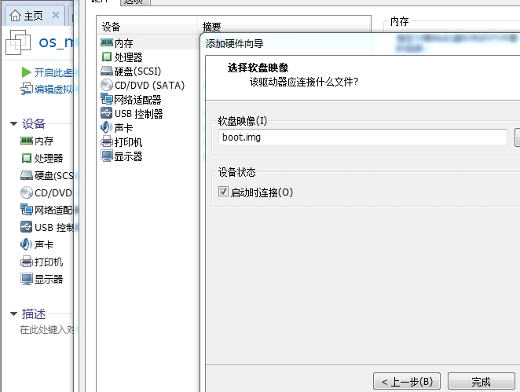

## 编写主引导程序，运行最基础的操作系统，直接实践

### mbr.S文件编写，编译和磁盘文件创建

Linux确保可以汇编（安装nasm），新建一个空目录，包含mbr.S和Makefile
代码见code/文件夹

```
$make build
$make image
```

这样可以生成一个镜像文件(注意观察文件大小)


查看镜像文件内容


### windows下在VMware虚拟机上运行OS

需要使用软盘




运行图


### 知识问题总结

* 基础知识

汇编基础

8086 16位CPU寄存器，地址总线（20根）

实模式内存地址访问（段地址：偏移）

* 实模式下1MB内存布局

http://book.51cto.com/art/201604/509566.htm

* BIOS

电脑加电，BIOS启动，自检，找到MBR

* 为什么MBR要从0x7c00h处开始执行？ 魔数（0x55 0xaa）

* linux的 dd, xxd命令的使用


### 参考

图书 《操作系统真相还原》

Linux下dd命令的使用
http://www.cnblogs.com/gotopower/articles/4378199.html

汇编--INT 10H功能
http://www.cnblogs.com/magic-cube/archive/2011/10/19/2217676.html

---