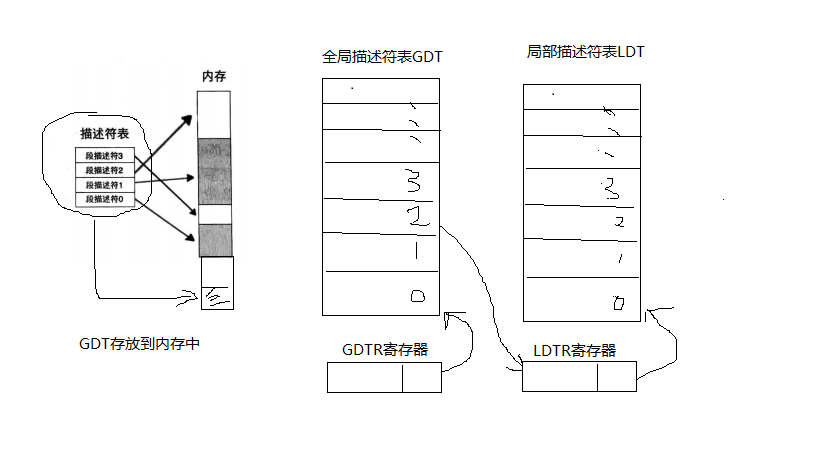

# 实模式下的一些问题

1. 实模式下操作系统和用户程序属于同一特权级，没有区别

2. 逻辑地址就是物理地址

3. 用户程序可以修改段基址，所有内存都能够访问到

4. 20根地址线，最大内存1M, 太小

5. 一次只能运行一个程序

6. 实模式下采用 段基址：偏移 访问内存，x86 16位寄存器最大是2^16=64KB自己，显然当访问的内存超过64KB时，就要更改段基址

所以有了保护模式。

保护模式（32位）

1. 地址线32根，最大内存4G
2. 32位寄存器，直接是可以访问到4G的

。。。


# 保护模式下的内存访问相关




* 实例

访问ds:0x9这样的内存


若选择子（段寄存器内容是0x8）
```
0000 0000 0000 1000

RPL: 00 
TI: 0 (表示使用了GDT, 而非LDT)
描述符索引值： 1， (结合TI, 则对应GDT中的第一个描述符）
```

假设第一个描述符 3个基址和起来后的内容是 0x1234

则段基址就是 0x1234


0x1234:0x9,最后访问的内存地址是0x123d

注意： 选择子忘记初始化，那个将访问第0个描述符，所以GDT第0个描述符不可用。若选择到了第0个描述符，则处理器会发生异常。

---
# GDT中的段描述符详解

参考如下系列文章

http://www.cnblogs.com/longintchar/p/5224405.html

段描述符64位太强大

# ?
