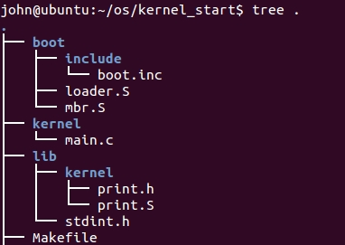
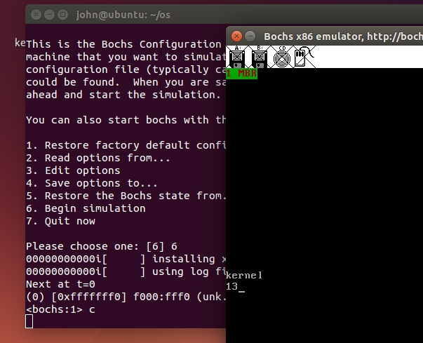

根据前面的基础，写一个简单的内核可以打印字符。

《操作系统真相还原》给出了源代码，我力图自己实践理解，确保有代码，也有运行截图。

我们需要理解磁盘上文件是如何安排的，1M的物理内存如何使用的，4G的虚拟内存如何使用的。

---
## 程序，虚拟机运行

* 代码目录结构



* 注意上述文件的编译运行在32bit环境下,因为要解析ELF文件，需要保持一致（32位和64位的ELF文件格式，有些数据结构大小，字段可能不同，所以解析会不同）

* Makefile
```
.PHONY:build image clean

img=/home/john/os/hd30M.img

mbr_src=mbr.S
loader_src=loader.S

mbr=mbr.bin
loader=loader.bin

mbr_loader:
	nasm -I boot/include/ -o boot/${mbr} boot/${mbr_src}
	nasm -I boot/include/ -o boot/${loader} boot/${loader_src}

build:
	nasm -f elf -o lib/kernel/print.o lib/kernel/print.S
	gcc -I lib/kernel -c -o kernel/main.o  kernel/main.c
	ld -Ttext 0xc0001500 -e main -o kernel/kernel.bin kernel/main.o lib/kernel/print.o

image:
	@-rm -rf $(img)
	bximage -hd -mode="flat" -size=30 -q $(img)
	dd if=./boot/mbr.bin of=$(img) bs=512 count=1 conv=notrunc
	dd if=./boot/loader.bin of=$(img) bs=512 seek=2 count=3 conv=notrunc
	dd if=./kernel/kernel.bin of=$(img) bs=512 seek=9 count=200 conv=notrunc

clean:
	@-rm -rf boot/*.img boot/*.bin boot/*.o /boot/*~
	@-rm -rf lib/*.img lib/*.bin lib/*.o lib/*~
	@-rm -rf lib/kernel/*.img lib/kernel/*.bin lib/kernel/*.o lib/kernel/*~
	@-rm -rf kernel/*.img kernel/*.bin kernel/*.o kernel/*~
	@-rm -rf *.o *.bin *.img *~

```

main.c（kernel）
```
#include "print.h"
void main(void) {
   put_char('k');
   put_char('e');
   put_char('r');
   put_char('n');
   put_char('e');
   put_char('l');
   put_char('\n');
   put_char('1');
   put_char('2');
   put_char('\b');
   put_char('3');
   while(1);
}
```

\n 换行
\b 删除前一字符

最后bochs运行结果图


bochs运行参考本工程02_mbr_hd下的bochs配置文件
---

## 操作系统说明

* 磁盘结构

* 文件加载，内核运行