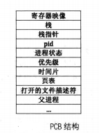

进程PCB，线程与进程的区别，线程的实现(用户级，内核级)

# 进程PCB

进程控制块(PCB)是系统为了管理进程设置的一个专门的数据结构。系统用它来记录进程的外部特征，描述进程的运动变化过程。同时，系统可以利用PCB来控制和管理进程，所以说，PCB（进程控制块）是系统感知进程存在的唯一标志。

PCB通常记载进程之相关信息，包括：
* 程序计数器：接着要运行的指令地址。
* 进程状态：可以是new、ready、running、waiting或 blocked等。
* CPU暂存器：如累加器、索引暂存器（Index register）、堆栈指针以及一般用途暂存器、状况代码等，主要用途在于中断时暂时存储数据，以便稍后继续利用；其数量及类因电脑架构有所差异。
* CPU排班法：优先级、排班队列等指针以及其他参数。
存储器管理：如标签页表等。
* 会计信息：如CPU与实际时间之使用数量、时限、账号、工作或进程号码。
* 输入输出状态：配置进程使用I/O设备，如磁带机。





#### 执行流

* cpu在任务之间切换，这样提高CPU的利用率。

* 任务就是一段指令流，只有"指令"才有执行的能力。

* 指令流对应于代码，大到可以是整个程序文件，即进程，小到可以是一个功能独立的代码块，即函数，而线程本质上就是函数。

指令流是独立的，它的独立性体现在每个执行流都有自己的械、一套自己的寄存器映像和内存资源，这是 Intel 处理器在硬件上规定的，其实这正是执行流的上下文环境。因此，我们要想构造一个执行流，就要为其提供这一整套的资源。

在任务调度器的眼里，只有执行流才是调度单元，即处理器上运行的每个任务都是调度器给分配的执行流，只要成为执行流就能够独立上处理器运行了，也就是说处理器会专门运行执行流中的指令。

#### 线程

线程是一套机制，此机制可以为一般的代码块创造它所依赖的上下文环境，从而让代码块具有独立性，因此在原理上线程能使一段函数成为调度单元（或称为执行流），使函数能被调度器“认可”，从而能够被专门调度到处理器上执行。这样，函数就可以被加入到线程表中作为调度器的调度单元，从而有机会单独获得处理器资源，也就是说，处理器不是把线程中调用的函数和其他指令混在一块执行的，或者说不是在执行整个进程时顺便执行了该函数， 、 而是单独、专门执行了此函数。


##### 在用户进程中实现线程

* 线程的调度算法是由用户程序自己实现的，可以根据实际应用情况为某些线程加权调度。

* 将线程的寄存器映像装载到 CPU 时，可以在用户空间完成，即不用陷入到内核态，这样就免去了进入内核时的入栈及出栈操作。

* 进程中的某个线程若出现了阻塞（通常是由于系统调用造成的），操作系统不知道进程中存在线程，它以为此进程是传统型进程（单线程进程），因此会将整个进程挂起，即进程中的全部线程都无法运行，

* 线程在用户空间中实现，线程属
于进程自己的"家务事"操作系统根本不知道它的存在。这就导致了：如果在用户空间中实现线程，但凡进程中的某个线程开始在处理器上执行后，只要该线程不主动让出处理器，此进程中的其他线程都没机会运行。也就是说，没有保险的机制使线程运行“适时飞即避免单一线程过度使用处理器，而其他线程没有调度的机会。这只能凭借开发人员“人为”地在线程中调用类似pthread_yield 或 pthread_exit 之类的方法使线程发扬“高风亮节”让出处理器使用权，此类方法通过回调方式触发进程内的线程调度器，让调度器有机会选择进程内的其他线程上处理器运行。重复强调：这里所说的“线程让出处理器使用权”，不是将整个进程的处理器使用权通过操作系统调度器交给其他进程，而是将控制权交给此进程自己的线程调度器，由自己的调度器将处理器使用权交给此进程中的下一个线程。


* 和在内核空间实现相比，只是在内部调度时少了陷入内核的代价，确实相当于提速，但由于整个进程占据处理器的时间片是有限的，这有限的时间片还要再分给内部的线程，所以每个线程执行的时间片非常非常短暂，再加上进程内线程调度器维护线程表、运行调度算法的时间片消耗，反而抵销了内部调度带来的提速。


##### 线程在内核空间实现

* 相比在用户空间中实现线程，内核提供的线程相当于**让进程多占了处理器资源**，比如系统中运行有进程 A 和一传统型进程 B，此时进程 A 中显式创建了 3 个线程，这样一来，进程 A 加上主线程便有了 4 个线程，加上进程 B，内核调度器眼中便有了 5 个独立的执行流，尽管其中 4 个都属于进程 A，但对调度器来说这 4个线程和进程一样被调度，因此调度器调度完一圈后，进程 A 使用了 80%的处理器资源，这才是真正的提速。

* 另一方面的优点是当进程中的某一线程阻塞后，由于线程是由内核空间实现的，操作系统认识线程，所以就只会阻塞这一个线程，此线程所在进程内的其他线程将不受影响，这又相当于提速了 。

* 缺点是用户进程需要通过系统调用陷入内核，这多少增加了 一些现场保护的枝操作，这还是会消耗一些处理器时间，但和上面的大幅度提速相比，这不算什么大事。

### 内核空间中实现线程，验证运行

intr_stack定义了程序的中断栈，无论进程还是线程，此结构用于中断发生时保护程序的上下文环境

```
/***********   中断栈intr_stack   ***********
 * 此结构用于中断发生时保护程序(线程或进程)的上下文环境:
 * 进程或线程被外部中断或软中断打断时,会按照此结构压入上下文
 * 寄存器,  intr_exit中的出栈操作是此结构的逆操作
 * 此栈在线程自己的内核栈中位置固定,所在页的最顶端
********************************************/
struct intr_stack {
    uint32_t vec_no;	 // kernel.S 宏VECTOR中push %1压入的中断号
    uint32_t edi;
    uint32_t esi;
    uint32_t ebp;
    uint32_t esp_dummy;	 // 虽然pushad把esp也压入,但esp是不断变化的,所以会被popad忽略
    uint32_t ebx;
    uint32_t edx;
    uint32_t ecx;
    uint32_t eax;
    uint32_t gs;
    uint32_t fs;
    uint32_t es;
    uint32_t ds;

/* 以下由cpu从低特权级进入高特权级时压入 */
    uint32_t err_code;		 // err_code会被压入在eip之后
    void (*eip) (void);
    uint32_t cs;
    uint32_t eflags;
    void* esp;
    uint32_t ss;
};

```

线程栈，PCB

```
/* 自定义通用函数类型,它将在很多线程函数中做为形参类型 */
typedef void thread_func(void*);

/* 进程或线程的状态 */
enum task_status {
   TASK_RUNNING,
   TASK_READY,
   TASK_BLOCKED,
   TASK_WAITING,
   TASK_HANGING,
   TASK_DIED
};

/***********  线程栈thread_stack  ***********
 * 线程自己的栈,用于存储线程中待执行的函数
 * 此结构在线程自己的内核栈中位置不固定,
 * 用在switch_to时保存线程环境。
 * 实际位置取决于实际运行情况。
 ******************************************/
struct thread_stack {
   uint32_t ebp;
   uint32_t ebx;
   uint32_t edi;
   uint32_t esi;

/* 线程第一次执行时,eip指向待调用的函数kernel_thread 
其它时候,eip是指向switch_to的返回地址*/
   void (*eip) (thread_func* func, void* func_arg);

/*****   以下仅供第一次被调度上cpu时使用   ****/

/* 参数unused_ret只为占位置充数为返回地址 */
   void (*unused_retaddr);
   thread_func* function;   // 由Kernel_thread所调用的函数名
   void* func_arg;    // 由Kernel_thread所调用的函数所需的参数
};

```

```
/* 进程或线程的pcb,程序控制块 */
struct task_struct {
   uint32_t* self_kstack;	 // 各内核线程都用自己的内核栈
   enum task_status status;
   uint8_t priority;		 // 线程优先级
   char name[16];
   uint32_t stack_magic;	 // 用这串数字做栈的边界标记,用于检测栈的溢出
};

void thread_create(struct task_struct* pthread, thread_func function, void* func_arg);

void init_thread(struct task_struct* pthread, char* name, int prio);

struct task_struct* thread_start(char* name, int prio, thread_func function, void* func_arg);

```

---

call 和 ret 汇编理解参考如下

http://blog.csdn.net/qq_26437925/article/details/70947174


线程相关函数

```
/* 由kernel_thread去执行function(func_arg) */
static void kernel_thread(thread_func* function, void* func_arg) {
   function(func_arg); 
}

/* 初始化线程栈thread_stack,将待执行的函数和参数放到thread_stack中相应的位置 */
void thread_create(struct task_struct* pthread, thread_func function, void* func_arg) {
   /* 先预留中断使用栈的空间,可见thread.h中定义的结构 */
   pthread->self_kstack -= sizeof(struct intr_stack);

   /* 再留出线程栈空间,可见thread.h中定义 */
   pthread->self_kstack -= sizeof(struct thread_stack);
   struct thread_stack* kthread_stack = (struct thread_stack*)pthread->self_kstack;
   kthread_stack->eip = kernel_thread;
   kthread_stack->function = function;
   kthread_stack->func_arg = func_arg;
   kthread_stack->ebp = kthread_stack->ebx = kthread_stack->esi = kthread_stack->edi = 0;
}

/* 初始化线程基本信息 */
void init_thread(struct task_struct* pthread, char* name, int prio) {
   memset(pthread, 0, sizeof(*pthread));
   strcpy(pthread->name, name);
   pthread->status = TASK_RUNNING; 
   pthread->priority = prio;
/* self_kstack是线程自己在内核态下使用的栈顶地址 */
   pthread->self_kstack = (uint32_t*)((uint32_t)pthread + PG_SIZE);
   pthread->stack_magic = 0x19870916;	  // 自定义的魔数
}

/* 创建一优先级为prio的线程,线程名为name,线程所执行的函数是function(func_arg) */
struct task_struct* thread_start(char* name, int prio, thread_func function, void* func_arg) {
/* pcb都位于内核空间,包括用户进程的pcb也是在内核空间 */
   struct task_struct* thread = get_kernel_pages(1);

   init_thread(thread, name, prio);
   thread_create(thread, function, func_arg);

   asm volatile ("movl %0, %%esp; pop %%ebp; pop %%ebx; pop %%edi; pop %%esi; ret" : : "g" (thread->self_kstack) : "memory");
   return thread;
}
```

PCB从内核空间中申请一页内存（即4096字节），*thread指向PCB最低地址
```
/* pcb都位于内核空间,包括用户进程的pcb也是在内核空间 */
   struct task_struct* thread = get_kernel_pages(1);
```

执行线程函数时，eip指向kernel_thread,处理器进入kernel_thread函数体时，栈顶为返回地址，栈顶地址加上4为参数function,栈顶地址加上8为参数func_arg

```
/* 由kernel_thread去执行function(func_arg) */
static void kernel_thread(thread_func* function, void* func_arg) {
   function(func_arg); 
}
```

使得PCB结构指针thread的 thread->sel_kstack作为栈顶
```
movl %0, %esp
```

弹出栈，这几个寄存器在线程栈中定义了的,初始为0，线程执行过程中这几个寄存器值变化。在函数调用时，ebp,ebx，edi,esi和esp这5个寄存器归主调用函数所用，其余寄存器归被调用函数所用，esp是栈顶，其值由函数调用约定来保证，所以线程栈中只保存了4个寄存器的值，在函数切换时，这4个寄存器的值会被保存起来。
```
pop %%ebp; 
pop %%ebx; 
pop %%edi; 
pop %%esi;
```

```
/* 初始化线程栈thread_stack,将待执行的函数和参数放到thread_stack中相应的位置 */
void thread_create(struct task_struct* pthread, thread_func function, void* func_arg) {
   /* 先预留中断使用栈的空间,可见thread.h中定义的结构 */
   pthread->self_kstack -= sizeof(struct intr_stack);

   /* 再留出线程栈空间,可见thread.h中定义 */
   pthread->self_kstack -= sizeof(struct thread_stack);
   struct thread_stack* kthread_stack = (struct thread_stack*)pthread->self_kstack;
   kthread_stack->eip = kernel_thread;
   kthread_stack->function = function;
   kthread_stack->func_arg = func_arg;
   kthread_stack->ebp = kthread_stack->ebx = kthread_stack->esi = kthread_stack->edi = 0;
}
```

ret会把栈顶数据作为返回地址送给CPU的eip去执行，而此时栈顶就是kernel_thread函数(再thread_create函数中kernel_thread赋值给了eip)，kernel_thread会去执行线程函数function(func_arg),这样线程就开始执行了。

---

### 测试和验证

```
#include "print.h"
#include "init.h"
#include "thread.h"

void k_thread_a(void*);

int main(void) {
   put_str("I am kernel\n");
   init_all();

   thread_start("k_thread_a", 31, k_thread_a, "argA ");

   while(1);
   return 0;
}

/* 在线程中运行的函数 */
void k_thread_a(void* arg) {     
/* 用void*来通用表示参数,被调用的函数知道自己需要什么类型的参数,自己转换再用 */
   char* para = arg;
   while(1) {
      put_str(para);
   }
}

```

运行截图

线程中不断的打印参数


---
