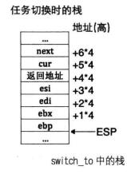

* 中断
* 上下文保护
* 轮询法实现线程调度

### 线程和线程管理设计

数据结构主要是实现**双向链表**。

多线程维持了两个链表，一个是全部线程链表，一个是就绪线程链表。


```
/* 进程或线程的状态 */
enum task_status {
   TASK_RUNNING,
   TASK_READY,
   TASK_BLOCKED,
   TASK_WAITING,
   TASK_HANGING,
   TASK_DIED
};
```

* 就绪队列中的线程可以直接在处理器上运行，当线程得不到CPU或者被阻塞了就需要从就绪队列中移除。

* 线程被换下: 时间片到了；时间片未到，被阻塞了；

* 调度器按照线程队列先进先出的顺序，把就绪队列中的第一个线程作为下一个要运行的线程。


采用ticks（时间片）和priority（线程优先级）配合使用； 优先级越高，那么执行时间就越长，当一个线程的ticks减少为0时，就需要被换下了，然后被重新赋予priority,下次再被调用。

### 线程调度

调度器schedule就是根据线程运行状态将其从处理器上换上换下，所以主要任务是读写就绪对垒，增删里面的结点。

线程在处理器上的执行时间有ticks决定，而在初始一个线程的时候会赋予一个线程优先级prioriy，ticks也赋值成了priority,这样优先级越高，线程执行时间就越长。系统会有时钟中断，每一次中断ticks减少1，当ticks减少至0是，时钟中断处理程序就调用调度器schedule,把该线程换下，选择另一个线程上CPU


完成整个调度需要如下的3部分：

1. 时钟中断处理函数
2. 调度器shedule
3. 任务切换函数switch_to

函数切换涉及到任务的上下文保护


中断发生时，当前运行的任务（线程或用户进程〉被打断，随后会去执行中断处理程序，不管当前任务在中断前的特权级是什么，执行中断处理程序时肯定都是 0 特权级。现在咱们已经达成共识，任务的代码包括用户代码＋内核代码，即使是部分用户代码，因此**进入中断后所执行的一切内核代码也依然属于当前任务，只是由内核来提供这一部分而己**。

* 上下文保护第一个部分：保存任务进入中断前的全部寄存器，目的是能让任务恢复到执中断前的状态。

* 上下文保护第二部分：保存API固定的寄存器，主要是esi,edi,ebp,esp这4个寄存器，目的是让任务恢复执行在任务切换发生时剩下尚未执行的内核代码，保证顺利走到退出中断的出口，利用第一部分保护的寄存器环境彻底恢复任务。


switch.S
```
[bits 32]
section .text
global switch_to
switch_to:
   ;栈中此处是返回地址	       
   push esi
   push edi
   push ebx
   push ebp

   mov eax, [esp + 20]		 ; 得到栈中的参数cur, cur = [esp+20]
   mov [eax], esp                ; 保存栈顶指针esp. task_struct的self_kstack字段,
				 ; self_kstack在task_struct中的偏移为0,
				 ; 所以直接往thread开头处存4字节便可。
;------------------  以上是备份当前线程的环境，下面是恢复下一个线程的环境  ----------------
   mov eax, [esp + 24]		 ; 得到栈中的参数next, next = [esp+24]
   mov esp, [eax]		 ; pcb的第一个成员是self_kstack成员,用来记录0级栈顶指针,
				 ; 用来上cpu时恢复0级栈,0级栈中保存了进程或线程所有信息,包括3级栈指针
   pop ebp
   pop ebx
   pop edi
   pop esi
   ret				 ; 返回到上面switch_to下面的那句注释的返回地址,
				 ; 未由中断进入,第一次执行时会返回到kernel_thread

```



---

### 线程，PCB结构，函数

```
/* 进程或线程的pcb,程序控制块 */
struct task_struct {
   uint32_t* self_kstack;	 // 各内核线程都用自己的内核栈
   enum task_status status;
   char name[16];
   uint8_t priority;
   uint8_t ticks;	   // 每次在处理器上执行的时间嘀嗒数

/* 此任务自上cpu运行后至今占用了多少cpu嘀嗒数,
 * 也就是此任务执行了多久*/
   uint32_t elapsed_ticks;

/* general_tag的作用是用于线程在一般的队列中的结点 */
   struct list_elem general_tag;				    

/* all_list_tag的作用是用于线程队列thread_all_list中的结点 */
   struct list_elem all_list_tag;

   uint32_t* pgdir;              // 进程自己页表的虚拟地址
   uint32_t stack_magic;	 // 用这串数字做栈的边界标记,用于检测栈的溢出
};
```

```
/***********  线程栈thread_stack  ***********
 * 线程自己的栈,用于存储线程中待执行的函数
 * 此结构在线程自己的内核栈中位置不固定,
 * 用在switch_to时保存线程环境。
 * 实际位置取决于实际运行情况。
 ******************************************/
struct thread_stack {
   uint32_t ebp;
   uint32_t ebx;
   uint32_t edi;
   uint32_t esi;

/* 线程第一次执行时,eip指向待调用的函数kernel_thread 
其它时候,eip是指向switch_to的返回地址*/
   void (*eip) (thread_func* func, void* func_arg);

/*****   以下仅供第一次被调度上cpu时使用   ****/

/* 参数unused_ret只为占位置充数为返回地址 */
   void (*unused_retaddr);
   thread_func* function;   // 由Kernel_thread所调用的函数名
   void* func_arg;    // 由Kernel_thread所调用的函数所需的参数
};
```

有个主线程问题，就是 mbr->loader->main,这是一直运行的主程序线程，其他线程都只是在创建过程中执行的。

```
/* 将kernel中的main函数完善为主线程 */
static void make_main_thread(void) {
/* 因为main线程早已运行,咱们在loader.S中进入内核时的mov esp,0xc009f000,
就是为其预留了tcb,地址为0xc009e000,因此不需要通过get_kernel_page另分配一页*/
   main_thread = running_thread();
   init_thread(main_thread, "main", 31);

/* main函数是当前线程,当前线程不在thread_ready_list中,
 * 所以只将其加在thread_all_list中. */
   ASSERT(!elem_find(&thread_all_list, &main_thread->all_list_tag));
   list_append(&thread_all_list, &main_thread->all_list_tag);
}
```


```
/* 创建一优先级为prio的线程,线程名为name,线程所执行的函数是function(func_arg) */
struct task_struct* thread_start(char* name, int prio, thread_func function, void* func_arg) {
/* pcb都位于内核空间,包括用户进程的pcb也是在内核空间 */
   struct task_struct* thread = get_kernel_pages(1);

   init_thread(thread, name, prio);
   thread_create(thread, function, func_arg);

   /* 确保之前不在队列中 */
   ASSERT(!elem_find(&thread_ready_list, &thread->general_tag));
   /* 加入就绪线程队列 */
   list_append(&thread_ready_list, &thread->general_tag);

   /* 确保之前不在队列中 */
   ASSERT(!elem_find(&thread_all_list, &thread->all_list_tag));
   /* 加入全部线程队列 */
   list_append(&thread_all_list, &thread->all_list_tag);

   return thread;
}
```

```
/* 初始化线程环境 */
void thread_init(void) {
   put_str("thread_init start\n");
   list_init(&thread_ready_list);
   list_init(&thread_all_list);
/* 将当前main函数创建为线程 */
   make_main_thread();
   put_str("thread_init done\n");
}
```


### 程序运行，验证
```
#include "print.h"
#include "init.h"
#include "thread.h"
#include "interrupt.h"

void k_thread_a(void*);
void k_thread_b(void*);
int main(void) {
   put_str("I am kernel\n");
   init_all();

   thread_start("k_thread_a", 8, k_thread_a, "arguA ");
   thread_start("k_thread_b", 31, k_thread_b, "arguB ");

   intr_enable();	// 打开中断,使时钟中断起作用
   while(1) {
      put_str("Main ");
   };
   return 0;
}

/* 在线程中运行的函数 */
void k_thread_a(void* arg) {     
/* 用void*来通用表示参数,被调用的函数知道自己需要什么类型的参数,自己转换再用 */
   char* para = arg;
   while(1) {
      put_str(para);
   }
}

/* 在线程中运行的函数 */
void k_thread_b(void* arg) {     
/* 用void*来通用表示参数,被调用的函数知道自己需要什么类型的参数,自己转换再用 */
   char* para = arg;
   while(1) {
      put_str(para);
   }
}
```


---

本例程序运行有GPy异常，这是由于临界区代码的资源竞争（屏幕输出，几个线程竞争资源造成的，需要利用同步，互斥等去处理）