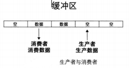

在键盘上操作是为了与系统进行交互，交互的过程一般是键入各种 shell 命令，然后 shell 解析并执行。shell 命令是由多个字符组成的，并且要以回车键结束，因此咱们在键入命令的过程中，必须要找个缓冲区把己键入的信息存起来，当凑成完整的命令名时再一井由其他模块处理。

---

* 线程同步之生产者消费者问题



缓冲区中有数据时，消费者可以消费；缓冲区有空位时，生产者可以生成（信号量可以解决生产者消费者问题）

* 利用双向链表实现环形缓冲区


* 数据结构和方法
```
#define bufsize 64

/* 环形队列 */
struct ioqueue {
// 生产者消费者问题
    struct lock lock;
 /* 生产者,缓冲区不满时就继续往里面放数据,
  * 否则就睡眠,此项记录哪个生产者在此缓冲区上睡眠。*/
    struct task_struct* producer;

 /* 消费者,缓冲区不空时就继续从往里面拿数据,
  * 否则就睡眠,此项记录哪个消费者在此缓冲区上睡眠。*/
    struct task_struct* consumer;
    char buf[bufsize];			    // 缓冲区大小
    int32_t head;			    // 队首,数据往队首处写入
    int32_t tail;			    // 队尾,数据从队尾处读出
};

void ioqueue_init(struct ioqueue* ioq);
bool ioq_full(struct ioqueue* ioq);
bool ioq_empty(struct ioqueue* ioq);

/* 消费者从ioq队列中获取一个字符 */
char ioq_getchar(struct ioqueue* ioq);

/* 生产者往ioq队列中写入一个字符byte */
void ioq_putchar(struct ioqueue* ioq, char byte);
```

让键盘缓冲区称为全局的，生产消费都操作


* 主程序验证

```
#include "print.h"
#include "init.h"
#include "thread.h"
#include "interrupt.h"
#include "console.h"

/* 临时为测试添加 */
#include "ioqueue.h"
#include "keyboard.h"

void k_thread_a(void*);
void k_thread_b(void*);

int main(void) {
   put_str("I am kernel\n");
   init_all();
   thread_start("consumer_a", 31, k_thread_a, " A_");
   thread_start("consumer_b", 31, k_thread_b, " B_");
   intr_enable();
   while(1); 
   return 0;
}

/* 在线程中运行的函数 */
void k_thread_a(void* arg) {     
   while(1) {
      enum intr_status old_status = intr_disable();
      if (!ioq_empty(&kbd_buf)) {
	 console_put_str(arg);
	 char byte = ioq_getchar(&kbd_buf);
	 console_put_char(byte);
      }
      intr_set_status(old_status);
   }
}

/* 在线程中运行的函数 */
void k_thread_b(void* arg) {     
   while(1) {
      enum intr_status old_status = intr_disable();
      if (!ioq_empty(&kbd_buf)) {
	 console_put_str(arg);
	 char byte = ioq_getchar(&kbd_buf);
	 console_put_char(byte);
      }
      intr_set_status(old_status);
   }
}

```


键盘不断的输入字母p,，屏幕交替的输出"A\_q","B\_q",ioqueue完成了缓冲区。