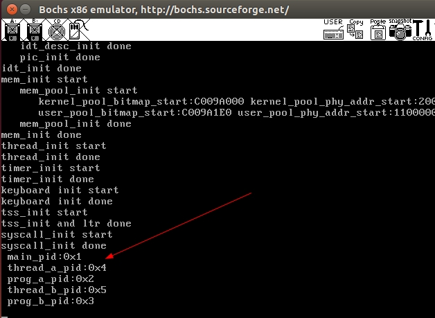

用户进程的实现

### 系统调用

* 系统调用由操作系统核心提供，运行于核心态，而普通的函数调用由函数库或用户自己提供，运行于用户态


* 系统调用在用户空间进程和硬件设备之间添加了一个中间层

 1. 它为用户空间提供了一种统一的硬件的抽象接口
 
 2. 系统调用保证了系统的稳定和安全。作为硬件设备和应用程序之间的中间人，内核可以基于权限和其他一些规则对需要进行的访问进行裁决。举例来说，这样可以避免应用程序不正确地使用硬件设备，窃取其他进程的资源，或做出其他什么危害系统的事情。

 3. 在Linux中，系统调用是用户空间访问内核的惟一手段；除异常和中断外，它们是内核惟一的合法入口。


* 用户空间的程序无法直接执行内核代码。如果果进程可以直接在内核的地址空间上读写的话，系统安全就会失去控制。所以，应用程序应该以某种方式通知系统，告诉内核自己需要执行一个系统调用，希望系统切换到内核态，这样内核就可以代表应用程序来执行该系统调用了。通知内核的机制是靠软件**中断**实现的。

参考

http://blog.csdn.net/zhuxiaoping54532/article/details/51700576

### 用户进程pid实现

* 进程结构体重新增pid成员变量

* pid采用静态全局变量，锁控制+1,确保唯一

* 进程初始化是就分配好pid

* 为进程添加系统调用getpid系统调用接口

代码见 16_system\code\

主函数
```
int main(void) {
   put_str("I am kernel\n");
   init_all();

   process_execute(u_prog_a, "user_prog_a");
   process_execute(u_prog_b, "user_prog_b");

   intr_enable();
   console_put_str(" main_pid:0x");
   console_put_int(sys_getpid());
   console_put_char('\n');
   thread_start("k_thread_a", 31, k_thread_a, "argA ");
   thread_start("k_thread_b", 31, k_thread_b, "argB ");
   while(1);
   return 0;
}

/* 在线程中运行的函数 */
void k_thread_a(void* arg) {     
   char* para = arg;
   console_put_str(" thread_a_pid:0x");
   console_put_int(sys_getpid());
   console_put_char('\n');
   console_put_str(" prog_a_pid:0x");
   console_put_int(prog_a_pid);
   console_put_char('\n');
   while(1);
}

/* 在线程中运行的函数 */
void k_thread_b(void* arg) {     
   char* para = arg;
   console_put_str(" thread_b_pid:0x");
   console_put_int(sys_getpid());
   console_put_char('\n');
   console_put_str(" prog_b_pid:0x");
   console_put_int(prog_b_pid);
   console_put_char('\n');
   while(1);
}

/* 测试用户进程 */
void u_prog_a(void) {
   prog_a_pid = getpid();
   while(1);
}

/* 测试用户进程 */
void u_prog_b(void) {
   prog_b_pid = getpid();
   while(1);
}
```

运行截图




---


