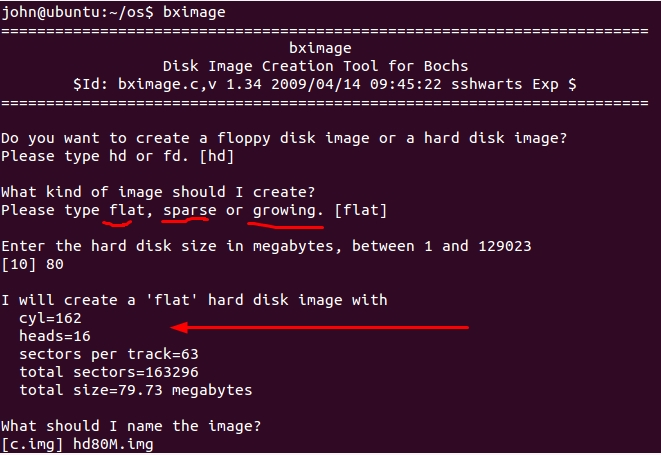
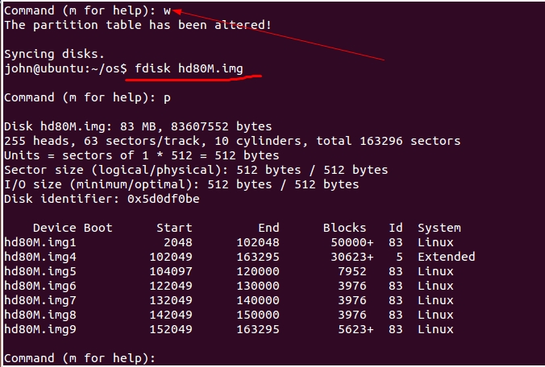
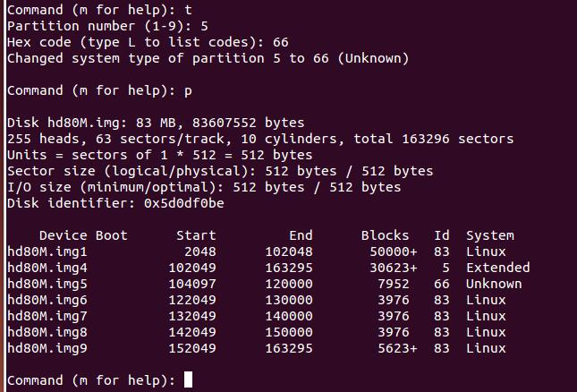
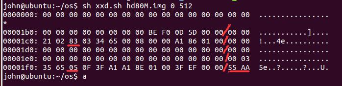

用户进程的实现

### bochs的bximage命令创建硬盘，BIOS识别




创建出的硬盘有格式，并且详细信息可以看到

*  柱面数 cyl=162
*  磁头数 heads=16
*  每磁道扇区数 sectors per track=63
*  总共的扇区数 total sectors=163296
*  总共大小 total size=79.73 megabytes


在bochs的配置文件中添加从盘hd80M.img

```
ata0-master: type=disk, mode=flat, path="/home/john/os/hd30M.img", cylinders=60, heads=16, spt=63
ata0-slave: type=disk, mode=flat, path="/home/john/os/hd80M.img", cylinders=162, heads=16, spt=63
```


* 在物理地址 Ox475 处存储着主机上安装的硬盘的数量，它是由 BIOS 检测并写入的，

bochs运行后，ctrl+c中断，然后使用xp命令查看

只有一个主磁盘


添加hd80M.img的从盘


---

### 磁盘相关概念

1. 硬盘容量＝单片容量×磁头数。

2. 单片容量＝每磁道扇区数×磁道数目×一个扇区大小。

扇区大小一般是512字节，扇区是硬盘读写的基本单位

磁盘读写很慢，因此操作系统不可能一次只写一个扇区，为了优化 1/0，操作系统把数据积攒到“多个扇区”时再一次性写入磁盘，这里的“多个扇区”就是指操作系统的**簇或块**。通常标准库函数还进行了二次优化，数据可以积攒到多个族或块时才写入，不过标准库中还提供了控制选项，可以立即把数据刷进硬盘。

以hd80M.img为例

```
*  柱面数 cyl=162
*  磁头数 heads=16
*  每磁道扇区数 sectors per track=63
*  总共的扇区数 total sectors=163296
*  总共大小 total size=79.73 megabytes
```

16（磁头数） * 162 （每个磁头的磁道数）* 63（m每个磁道的扇区数）* 512 （每个扇区的大小）= 83607552B 即 79.73MB

---

#### 分区

熟悉的磁盘分区格式:MBR, GPT

* 分区：人为地将硬盘上的柱面扇区划分成不同的分组，每个分组都是单独的分区。各分区都有“描述符”来描述分区本身所在硬盘上的起止界限等信息.

* MBR分区中有个 64 字节“固定大小”的数据结构，这就是著名的**分区表**，分区表中的每个表项就是一个分区的“描述符”，表项大小是 16 字节，因此 64 字节的分区表总共可容纳 4 个表项，这就是为什么MBR分区格式的硬盘仅支持 4 个分区的原因。


MBR (MainBootR四ord ）即主引导记录，它是一段引导程序，其所在的扇区称为主引导扇区，该扇区位于 0 盘。道 1 扇区（物理扇区编号从 1 开始，逻辑扇区地址 LBA 从 0 开始），也就是硬盘最开始的扇区，扇区大小为 512 宇节，这 512 字节内容由三部分组成。

1. 主引导记录 MBR 
2. 磁盘分区表 DPT 
3. 结束魔数 55AA ，表示此扇区为主引导扇区，里面包含控制程序

MBR引导程序位于主引导扇区中偏移 0～OxlBD 的空间，共计 446 字节大小，这其中包括硬盘参数及部分指令（由 BIOS 跳入执行），它是由分区工具产生的，独立于任何操作系统。

OxlBD-OxlFD 64字节就是磁盘分区表 DPT 

磁盘分区表（ Disk Partition Table ）简称 DPT，是由多个分区元信息汇成的表，表中每一个表项都对
应一个分区，主要记录各分区的起始扇区地址，大小界限等 。16字节内容如下


魔数 55AA 作为主引导扇区的有效标志，位于扇区偏移 OxlFE～OxI FF，也就是最后 2 个字节。

---

* 分区表共4个分区，那个分区作为扩展分区都可以，扩展分区是可选的，最多只能有一个；其余的都是主分区。扩展分区中的第一个逻辑分区的编号从5开始。


* 分区可以继续分成小的子分区,这就是逻辑分区，逻辑分区只存在扩展分区，他属于扩展分区的子集。

---

#### fdisk 分区实践

hd80M.img 空盘查看


设置磁盘的柱面数，磁头数


添加分区


根据扩展分区创建逻辑分区


保存分区信息




查看已知的文件系统id


设置分区的文件系统id



---

最后的磁盘信息如下


```
#usage: sh xxd.sh 文件 起始地址 长度 
xxd -u -a -g 1 -s $2 -l $3 $1 
```



16字节信息规定


```
 00 
 00 
 21 
 02 
 83 （文件系统id）
 03 
 34 
 65 
 00 08 00 00 （ 分区起始偏移扇区 0x00000800）
 A1 86 01 00 ( 扇区总数 0x000186A1)
```

```
 00
 03 
 35 
 65 
 05 （文件系统id）
 0F 
 3F 
 A1 
 A1 8E 01 00 （ 分区起始偏移扇区 0x00018EA1 ）
 3F EF 00 00  ( 扇区总数 0x0000EF3F )
```

查看扩展分区

0x00018EA1*512 = 0x031D4200


#### 编写硬盘驱动程序