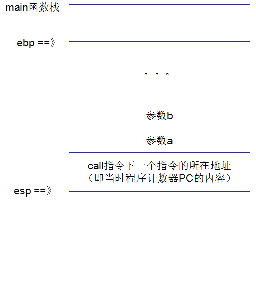
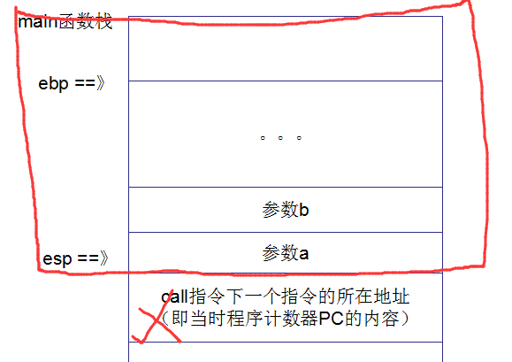

# call ret指令

## 汇编程序

* windows平台下的c程序

```cpp
int fun(int a, int b)
{
	a += 1;
	b *= 2;
	int c = a + b;
	return c;
}

int main()
{	
	int a = 1;
	int b = 2;
	int c = fun(a, b);
	printf("%d\n", c);
	return 0;
}
```

* 汇编程序

```cpp
int main()
{	
00938270  push        ebp  
00938271  mov         ebp,esp  
00938273  sub         esp,0E4h  
00938279  push        ebx  
0093827A  push        esi  
0093827B  push        edi  
0093827C  lea         edi,[ebp-0E4h]  
00938282  mov         ecx,39h  
00938287  mov         eax,0CCCCCCCCh  
0093828C  rep stos    dword ptr es:[edi]  
	int a = 1;
0093828E  mov         dword ptr [a],1  
	int b = 2;
00938295  mov         dword ptr [b],2  
	int c = fun(a, b);
0093829C  mov         eax,dword ptr [b]  
0093829F  push        eax  
009382A0  mov         ecx,dword ptr [a]  
009382A3  push        ecx  
009382A4  call        fun (93710Dh)  
009382A9  add         esp,8  
009382AC  mov         dword ptr [c],eax  
	printf("%d\n", c);
009382AF  mov         eax,dword ptr [c]  
009382B2  push        eax  
009382B3  push        offset string "%d" (983EE8h)  
009382B8  call        @ILT+3880(_printf) (936F2Dh)  
009382BD  add         esp,8  
	return 0;
009382C0  xor         eax,eax  
}
```

## 内存栈和call指令


注意到：<font color='red'>函数调用一定是call指令</font>

```cpp
009382A4  call        fun (93710Dh)  
```

注意到call指令之前的一些指令: 是参数入栈，而且是**从右到左**的顺序

```cpp
0093829C  mov         eax,dword ptr [b]  
0093829F  push        eax  
009382A0  mov         ecx,dword ptr [a]  
009382A3  push        ecx
```

CALL指令（"调用"指令）的功能，就是以下两点：

1. 将下一条指令的所在地址（即当前程序计数器PC的内容）入栈（理解为保护当前线程栈）
2. 并将子程序的起始地址送入PC（于是CPU的下一条指令就会转去执行子程序）

## 执行栈的变化分析

1. 在main线程栈中，将参数压入，并将call指令下一条指令所在地址也压入栈



2. call之后，debug就能进入fun函数里面，此时的操作时`push ebp`

这是保存上一个函数栈的ebp, 也就是保存main函数栈，可以发现main函数开头也是这一句。（所以，每个函数都有自己的函数栈，但都是在整个内存栈中）

3. push指令后，esp是自动往下移动了的，这一个是把当前的esp赋值给ebp（所以，main函数的ebp，保存了的，这里ebp变化了，也就形成了fun函数自己的函数栈了）

```cpp
mov         ebp,esp  
sub         esp,0CCh
```

sub操作是给当前函数分配栈大小的初始空间

4. 接着进入到fun函数栈了


5. return

```cpp
	return c;
011C8248  mov         eax,dword ptr [c]  
}
011C824B  pop         edi  
011C824C  pop         esi  
011C824D  pop         ebx  
011C824E  mov         esp,ebp  
011C8250  pop         ebp  
011C8251  ret
```

return语句，可以看到最后的返回结果存到了eax中, fun函数的最后3条指令

```cpp
011C824E  mov         esp,ebp  
011C8250  pop         ebp  
011C8251  ret
```

* `mov esp, ebp`就是清除fun的函数栈，现在esp指向了ebp（ebp就是原来fun函数的栈底地址）
* `pop ebp`就是弹出main函数的ebp

即如下的1,2操作，接着函数栈变成了，如下图红色框里面的内容：


## ret指令

ret指令用栈中的数据，修改IP的内容，从而实现近转移； CPU执行ret指令时，进行下面的两步操作：

1. (IP) = ((ss)*16 +(sp))
2. (sp) = (sp)+2

经过上面的两条语句后，esp指向了 上图中[call指令下一个指令的所在地址] 那里， IP刚好取得地址，然后回到原来，main函数的地方

接着 esp 增加，也就是出栈，所以 main函数栈如下



回到main函数中

```cpp
011C82A4  call        fun (11C710Dh)  
011C82A9  add         esp,8  
011C82AC  mov         dword ptr [c],eax  
	printf("%d\n", c);
011C82AF  mov         eax,dword ptr [c]  
011C82B2  push        eax  
011C82B3  push        offset string "%d" (1213EE8h)  
011C82B8  call        @ILT+3880(_printf) (11C6F2Dh)  
011C82BD  add         esp,8
```

call指令之后是`add esp 8`操作，这是因为有两个参数，所以`add esp 8` ，弹出两个int参数

`mov dword ptr [c],eax`操作则是把fun函数返回结果存储到变量c中，即函数调用完后，一切恢复正常（fun函数栈已经被清除掉了）；回到main的函数栈中，即如下图


