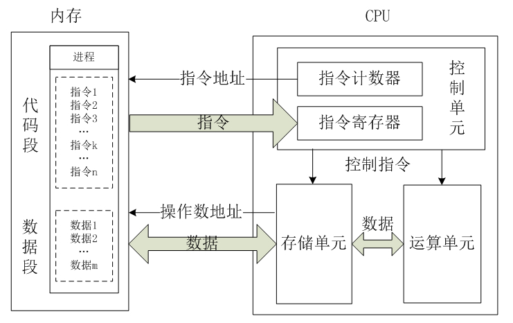
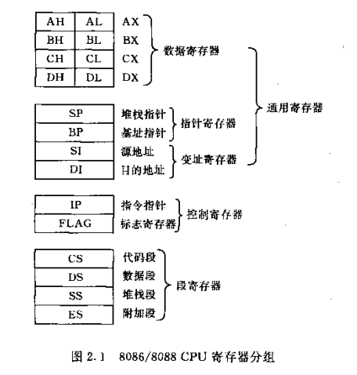

# CPU常识

## CPU整体架构



cpu整体可分为三部分：

* 控制单元（CU）

控制单元是整个CPU的指挥控制中心，由程序计数器PC（Program Counter）, 指令寄存器IR(Instruction Register)、指令译码器ID(Instruction Decoder)和操作控制器OC(Operation Controller)等，对协调整个电脑有序工作极为重要。它根据用户预先编好的程序，依次从存储器中取出各条指令，放在指令寄存器IR中，通过指令译码(分析)确定应该进行什么操作，然后通过操作控制器OC，按确定的时序，向相应的部件发出微操作控制信号。操作控制器OC中主要包括节拍脉冲发生器、控制矩阵、时钟脉冲发生器、复位电路和启停电路等控制逻辑。

* 运算单元（ALU）

是运算器的核心。可以执行算术运算(包括加减乘数等基本运算及其附加运算)和逻辑运算(包括移位、逻辑测试或两个值比较)。相对控制单元而言，运算器接受控制单元的命令而进行动作，即运算单元所进行的全部操作都是由控制单元发出的控制信号来指挥的，所以它是执行部件。

* 存储单元

包括CPU片内缓存和寄存器组，是CPU中暂时存放数据的地方，里面保存着那些等待处理的数据，或已经处理过的数据，CPU访问寄存器所用的时间要比访问内存的时间短。采用寄存器，可以减少CPU访问内存的次数，从而提高了CPU的工作速度。但因为受到芯片面积和集成度所限，寄存器组的容量不可能很大。寄存器组可分为专用寄存器和通用寄存器。专用寄存器的作用是固定的，分别寄存相应的数据。而通用寄存器用途广泛并可由程序员规定其用途，通用寄存器的数目因微处理器而异。

## 8086各类寄存器

### 8086 CPU架构


### 8086的14个寄存器



#### 数据寄存器

数据寄存器主要用来保存操作数或运算结果等信息，它们的存在节省了为存取操作数所需占用总线和访问存储器的时间。

* AX和AL寄存器又称为累加器（Accumulator），使用得比较普遍。
* BX寄存器称为基（Base）地址存储器，它是四个数据存储器中唯一可以作为存储器指针使用的存储器。
* CX寄存器称为计数（Count）寄存器。在字符串操作和循环操作时，用它来控制重复循环操作次数。在移位操作时，CL寄存器用于保存移位的位数。
* DX寄存器称为数据（Data）寄存器。在进行32位的乘除法操作时，用它存放被除数的高16位或余数。它也用于存放I/O端口地址

#### 变址和指针寄存器

变址和指针寄存器主要用于存放某个存储单元地址的偏移，或某组存储单元开始地址的偏移，即作为存储器指针使用。

作为通用寄存器，它们也可以保存16位算术逻辑运算中的操作数和运算结果，有时运算结果就是需要的存储单元地址的偏移。注意，16位的变址寄存器和指针寄存器不能分解成8位寄存器使用。

* SI和DI寄存器称为变址寄存器。在字符串操作中，规定由SI（Source Index）给出源指针，由DI（Destination Index）给出目的指针。当然，SI和DI也可作为一般存储器指针使用。

* BP和SP寄存器称为指针寄存器。BP（Base Pointer）主要用于给出堆栈中数据区基址的偏移，SP（Stack Pointer）通常只作为堆栈指针使用，即保存堆栈栈顶地址的偏移。

#### 段寄存器

8086/8088 CPU依赖其内部的四个段寄存器实现寻址1M字节物理地址空间（20条地址线）。8086/8088把1M字节地址空间分成若干逻辑段，当前使用段的段值存放在段寄存器中。

* CS (Code Segment)：代码段寄存器
* DS (Data Segment)：数据段寄存器
* SS (Stack Segment)：堆栈段寄存器
* ES (Extra Segment)：附加段寄存器

## 8086指令和寻址方式

一条指令 包括 操作码和操作数

* 操作码: 表示指令执行什么操作，如mov，add，sub等等

* 操作数：参加操作的数或数的存放地址（寄存器，各种地址表示格式）

寻找操作数存放的地址称为寻址方式，可分为如下几类

1. 立即寻址方式 MOV AL，06H

2. 寄存器寻址方式 MOV BX，AX

3. 直接寻址方式

```cpp
MOV BX, DS:[2000H]
操作数存放在存储器中, 偏移量直接写在操作数中,.

地址为数据段寄存器DS的值* 16 (<<4)然后加上直接给出的偏移量2000H.
```

4. 寄存器间接寻址方式

```cpp
操作数存放在存储器中, 16位偏移地址存放在SI, DI, BP, BX四个寄存器之一中.

若使用BX, SI, DI之一作为寄存器, 操作数默认放在DS所决定的数据段中.

即地址为:DS *16 + BX

示例:

MOV AX, [SI] ; 将DS*16 + SI中的值放入AX中
若使用BP做间接寻址, 操作数默认放在SS决定的堆栈段中.

示例:

MOV AX, [BP]  ;将SS*16 + BP中的值放入AX中
可以直接指定使用的段寄存器:

MOV  AX, SS:[SI]  ;将SS*16 + SI中的值放入AX中
```

5. 寄存器相对寻址方式

```cpp
操作数存放在存储器中, 使用段寄存器内容* 16 加SI, DI, BP, BX四个寄存器之一的内容再加直接给出的位移量.

若使用BX, SI, DI之一作为寄存器, 操作数默认放在DS所决定的数据段中; 若使用BP做间接寻址, 操作数默认放在SS决定的堆栈段中.

与寄存器间接寻址相比只是增加了直接给出的偏移量:

示例:

MOV AX, [SI-2] ; 将 DS*16 + SI - 2中的值放入AX中
MOV AX, [BP+4]  ;将 SS*16 + BP + 4中的值放入AX中
MOV AX, SS:[SI-8]  ;将 SS*16 + SI - 8中的值放入AX中
```

6. 基址变址寻址方式

```java
将段地址寄存器的值*16加上基址寄存器(BX,BP)之一的地址加上变址寄存器(SI, DI)之一的值作为地址.

若使用BX作基址 操作数默认放在DS所决定的数据段中; 若使用BP做基址, 操作数默认放在SS决定的堆栈段中.

示例:

MOV AX, [BX][SI] ; 将 DS*16 +BX + SI中的值放入AX中
MOV AX, [BP][DI]  ;将 SS*16 + BP + DI 中的值放入AX中
MOV AX SS:[Bx][SI]  ;将 SS*16 + BX + SI 中的值放入AX中
```

7. 相对基址变址寻址方式

```java
在基址变址寻址基础上再加一个直接给出的偏移量：

示例：

MOV AX, 1234H[BX][DI]　;将DS * 16 + BX + DI + 1234H中的值放入AX中.
还有几种表示方法与上式等价:

MOV AX, [BX+DI+1234H]

MOV AX, 1234H[BX+DI]

MOV AX, 1234H[BX][DI]
```

## 汇编代码中的 eax, ebx, ecx, edx, esi, edi, ebp, esp等

EAX 是"累加器"(accumulator), 它是很多加法乘法指令的缺省寄存器。

EBX 是"基地址"(base)寄存器, 在内存寻址时存放基地址。

ECX 是计数器(counter), 是重复(REP)前缀指令和LOOP指令的内定计数器。

EDX 则总是被用来放整数除法产生的余数。

ESI/EDI分别叫做"源/目标索引寄存器"(source/destination index),因为在很多字符串操作指令中, DS:ESI指向源串,而ES:EDI指向目标串.

EBP是"基址指针"(BASE POINTER), 它最经常被用作高级语言函数调用的"框架指针"(frame pointer). 在破解的时候,经常可以看见一个标准的函数起始代码:

```cpp
push ebp ;保存当前ebp
mov ebp,esp ;EBP设为当前堆栈指针
sub esp, xxx ;预留xxx字节给函数临时变量.
```

ESP 专门用作堆栈指针，被形象地称为栈顶指针，堆栈的顶部是地址小的区域，压入堆栈的数据越多，ESP也就越来越小。在32位平台上，ESP每次减少4字节。
