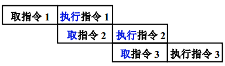

# CPU指令相关

## 指令周期

指令周期：是指计算机**从取指到指令执行完毕**的时间

计算机执行指令的过程可以分为以下三个步骤：

1. Fetch（取指），也就是从 PC 寄存器里找到对应的指令地址，根据指令地址从内存里把具体的指令，加载到指令寄存器中，然后把 PC 寄存器自增，好在未来执行下一条指令。
2. Decode（译码），也就是根据指令寄存器里面的指令，解析成要进行什么样的操作，是 R、I、J 中的哪一种指令，具体要操作哪些寄存器、数据或者内存地址。
3. Execute（执行指令），也就是实际运行对应的 R、I、J 这些特定的指令，进行算术逻辑操作、数据传输或者直接的地址跳转。

## CPＵ周期

CPU周期亦称机器周期，在计算机中，为了便于管理，常把一条指令的执行过程划分为若干个阶段，每一阶段完成一项工作。

例如，取指令、存储器读、存储器写等，这每一项工作称为一个基本操作（注意：每一个基本操作都是由若干CPU最基本的动作组成）。完成一个基本操作所需要的时间称为机器周期。通常用内存中读取一个指令字的最短时间来规定CPU周期。

## 时钟周期

时钟周期也称为振荡周期，定义为时钟频率的倒数。时钟周期是计算机中最基本的、最小的时间单位。在一个时钟周期内，CPU仅完成一个最基本的动作。

## 周期关系

## 常见问题：移位运算为什么比乘法除法快？

因为移位指令(单周期指令)占2个机器周期，而乘除法指令占4个机器周期。从硬件上看，移位对硬件更容易实现；所以从效率上看，使用移位指令有更高的效率。

## 指令流水线

* 指令的二级流水

* 指令的6级流水

1. 取指FI:从存储器取出一条指令放入指令部件缓冲区
2. 指令译码DI:确定操作性质和操作数地址形成方式
3. 计算操作数地址CO:计算操作有效地址
4. 取操作数FO:从存储器中取出操作数
5. 执行指令EI:执行指令，将结果存入目的位置
6. 写操作书WO:将结果存入寄存器

