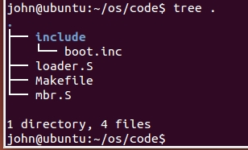
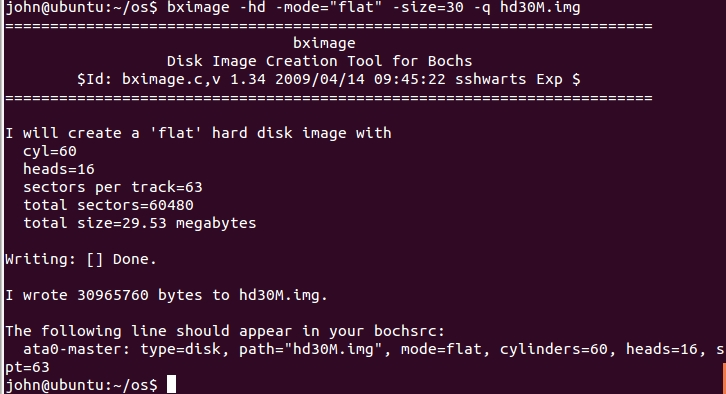
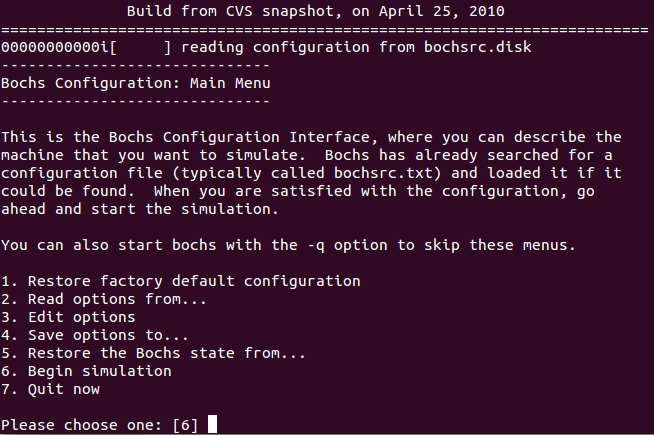
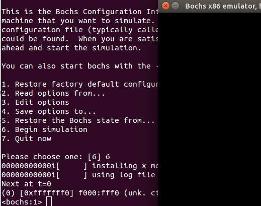
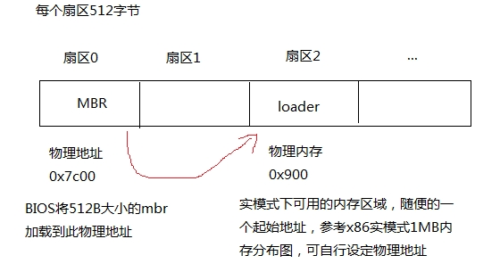

# 让MBR直接操作硬盘，对硬盘进行读写操作

* 上一步成功进入MBR了，这样MBR的功能就能丰富下去
* 硬盘概念：柱面，磁道，扇区

# 环境

* ubuntu14-32bit
* bochs-2.4.5

注：ubuntu安装bochs如果有问题，可自行搜索解决

# 代码编写

代码目录<a href="https://github.com/doctording/os/tree/master/docs/content/02_mbr_hd/code" target="_blank">相应的code文件夹</a>

需要自己修改Makefile,生成的目录可自行设定



* 通过`bximage`来制作硬盘



* 在配置bochs文件时，根据需要配置，具体见code/bochsrc.dist文件

* <font color='red'>bochs模拟了硬件</font>

* 这里需要添加从硬盘启动的，硬盘信息

```java
ata0-master: type=disk, mode=flat, path="/home/john/os/hd30M.img", cylinders=60, heads=16, spt=63
```

# 运行虚拟机

* 制定配置文件运行

```java
$bochs -f bochsrc.dist
```



* 按6开始模拟



* 再按c运行起来


* 遇到模拟器卡死情况，kill杀死


# 分析

## 首先硬盘结构如下



## 实模式下的1MB内存布局

http://book.51cto.com/art/201604/509566.htm

硬盘当成一个IO设备，其有硬盘控制器（I/O接口）,就像显示器一样，其有显卡（也称为显示适配器），显存

我们操作了 用于文本模式显示适配器 ，其在1M物理地址下的开始地址是 0xB8000（有32KB大小）。

* 首先需要明确：对`0xb8000`这个内存地址写入内容，就可以在屏幕上输出文本;
* 本例我们使用gs寄存器存储了`0xb8000`这个地址，loader则存到磁盘的第2扇区，其操作了gs寄存器;
* mbr操作磁盘第二扇区（即loader），读取的内容存到`0x900`这个内存地址中;
* 此后，当mbr jmp到`0x900`这个内存地址时，就会执行0x900这块内存的指令，也就是是loader中的内容，也就是操作`0xb8000`这个内存地址，也即向屏幕中显示文本。

# 参考

## x86 显示相关

http://blog.csdn.net/longintchar/article/details/70183677
