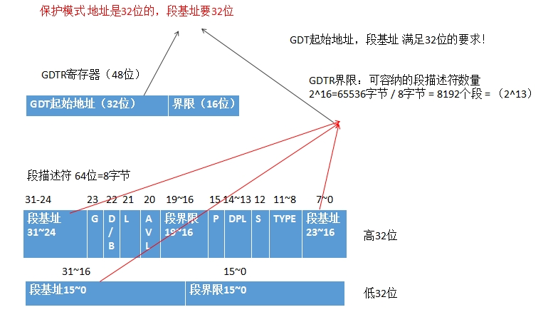
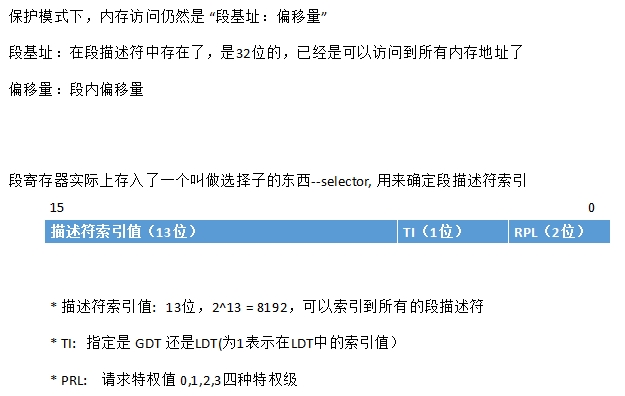

# 实模式下的一些问题

1. 实模式下操作系统和用户程序属于同一特权级，没有区别

2. 逻辑地址就是物理地址

3. 用户程序可以修改段基址，所有内存都能够访问到

4. 20根地址线，最大内存1M, 太小

5. 一次只能运行一个程序

6. 实模式下采用 段基址：偏移 访问内存，x86 16位寄存器最大是2^16=64KB自己，显然当访问的内存超过64KB时，就要更改段基址

所以有了保护模式。

保护模式（32位）

1. 地址线32根，最大内存4G
2. 32位寄存器，直接是可以访问到4G的

。。。


# 保护模式下的内存访问相关







* 实例

访问ds:0x9这样的内存


若选择子（段寄存器内容是0x8）
```
0000 0000 0000 1000

RPL: 00 
TI: 0 (表示使用了GDT, 而非LDT)
描述符索引值： 1， (结合TI, 则对应GDT中的第一个描述符）
```

假设第一个描述符 3个基址和起来后的内容是 0x1234

则段基址就是 0x1234


0x1234:0x9,最后访问的内存地址是0x123d

注意： 选择子忘记初始化，那个将访问第0个描述符，所以GDT第0个描述符不可用。若选择到了第0个描述符，则处理器会发生异常。

---
# GDT中的段描述符详解

参考如下系列文章

http://www.cnblogs.com/longintchar/p/5224405.html

段描述符64位太强大


## 代码讲解
02的代码若没有问题，这次mbr.S不需要修改，唯一的修改就是读入的扇区数要变大，
原来只有一个第2扇区，现在利用磁盘读写第2,3,4,5四个扇区（这当然是可变的）。

需要弄清楚这4个扇区究竟存了些什么东西。

显然要是保护模式，需要有 GDT，段描述符，选择子等，内存不再是直接“段基址：偏移量”直接访问了，而是通过段描述符

* boot.S 分析
```
;-------------	 loader和kernel   ----------

LOADER_BASE_ADDR equ 0x900 
LOADER_START_SECTOR equ 0x2

;--------------   gdt描述符属性  -------------
DESC_G_4K   equ	  1_00000000000000000000000b   
DESC_D_32   equ	   1_0000000000000000000000b
DESC_L	    equ	    0_000000000000000000000b	;  64位代码标记，此处标记为0便可。
DESC_AVL    equ	     0_00000000000000000000b	;  cpu不用此位，暂置为0  
DESC_LIMIT_CODE2  equ 1111_0000000000000000b
DESC_LIMIT_DATA2  equ DESC_LIMIT_CODE2
DESC_LIMIT_VIDEO2  equ 0000_000000000000000b
DESC_P	    equ		  1_000000000000000b
DESC_DPL_0  equ		   00_0000000000000b
DESC_DPL_1  equ		   01_0000000000000b
DESC_DPL_2  equ		   10_0000000000000b
DESC_DPL_3  equ		   11_0000000000000b
DESC_S_CODE equ		     1_000000000000b
DESC_S_DATA equ	  DESC_S_CODE
DESC_S_sys  equ		     0_000000000000b
DESC_TYPE_CODE  equ	      1000_00000000b	;x=1,c=0,r=0,a=0 代码段是可执行的,非依从的,不可读的,已访问位a清0.  
DESC_TYPE_DATA  equ	      0010_00000000b	;x=0,e=0,w=1,a=0 数据段是不可执行的,向上扩展的,可写的,已访问位a清0.

DESC_CODE_HIGH4 equ (0x00 << 24) + DESC_G_4K + DESC_D_32 + DESC_L + DESC_AVL + DESC_LIMIT_CODE2 + DESC_P + DESC_DPL_0 + DESC_S_CODE + DESC_TYPE_CODE + 0x00
DESC_DATA_HIGH4 equ (0x00 << 24) + DESC_G_4K + DESC_D_32 + DESC_L + DESC_AVL + DESC_LIMIT_DATA2 + DESC_P + DESC_DPL_0 + DESC_S_DATA + DESC_TYPE_DATA + 0x00
DESC_VIDEO_HIGH4 equ (0x00 << 24) + DESC_G_4K + DESC_D_32 + DESC_L + DESC_AVL + DESC_LIMIT_VIDEO2 + DESC_P + DESC_DPL_0 + DESC_S_DATA + DESC_TYPE_DATA + 0x0b

;--------------   选择子属性  ---------------
RPL0  equ   00b
RPL1  equ   01b
RPL2  equ   10b
RPL3  equ   11b
TI_GDT	 equ   000b
TI_LDT	 equ   100b
```


将如下的地址对应到段描述符的高32位中的 0-23位

* G位
```
DESC_G_4K   equ	  1_00000000000000000000000b 
```
得到：
G=1 代表段基址的粒度是4KB（段界限将达到4G）

* D位
```
DESC_D_32   equ	   1_0000000000000000000000b
```
这里分D和B,1是D,代表数据段，0是B，代表堆栈段

* type


* 选择子属性，选择子最终的定义在loader.S中

选择子，16位，可以索引到段描述符（忘记了，就往上翻）


*  全局描述符表(GDT)的构造
```
;构建gdt及其内部的描述符
   GDT_BASE:   dd    0x00000000 
	       dd    0x00000000

   CODE_DESC:  dd    0x0000FFFF 
	       dd    DESC_CODE_HIGH4

   DATA_STACK_DESC:  dd    0x0000FFFF
		     dd    DESC_DATA_HIGH4

   VIDEO_DESC: dd    0x80000007	       ;limit=(0xbffff-0xb8000)/4k=0x7
	       dd    DESC_VIDEO_HIGH4  ; 此时dpl已改为0
```
GDT的三个段描述符： 代码段，堆栈段，显存段；GDT的第0个段不可用
段描述符 64bit = 8B(dd是4字节，所以用两个ddd定义一个段描述符)


实模式下内存地址 0xb8000到0xbffff是显示适配器BIOS所在区域，当段粒度是4k时，段界限大小为 0xbffff-0xb800/4k = 7, 所以段界限设为7，就足够表示这部分的内存区域了


* 构造选择子（16位，可以索引到段描述符，13位索引+1位TI+2位RPL）
```
SELECTOR_CODE equ (0x0001<<3) + TI_GDT + RPL0         ; 相当于(CODE_DESC - GDT_BASE)/8 + TI_GDT + RPL0

SELECTOR_DATA equ (0x0002<<3) + TI_GDT + RPL0	 ; 同上

SELECTOR_VIDEO equ (0x0003<<3) + TI_GDT + RPL0	 ; 同上 
```

三个选择子的内容分别是（注意索引0是没有用的，这里三个索引1,2,3），都访问GDT而非LDT, 请求特权级都是0级
```
0000000000000   00  0
1   TI_GDT  RPL0
2  TI_GDT  RPL0
3   TI_GDT  RPL0
```

# 实模式到保护模式的设置和跳转

进入保护模式，需要设置控制寄存器的cr0寄存器，其pe位置1，8686要打开A20，这些都在实模式完成，实模式也会设置GDT
```
lgdt [gdt_ptr]
```
GDT由gdtr寄存器加载(gdtr 48bit=6B,前16bit界限，后32bit是起始地址)

```
GDT_SIZE   equ   $ - GDT_BASE
GDT_LIMIT   equ   GDT_SIZE -	1 
times 60 dq 0					 ; 此处预留60个描述符的slot
SELECTOR_CODE equ (0x0001<<3) + TI_GDT + RPL0         ; 相当于(CODE_DESC - GDT_BASE)/8 + TI_GDT + RPL0
SELECTOR_DATA equ (0x0002<<3) + TI_GDT + RPL0	 ; 同上
SELECTOR_VIDEO equ (0x0003<<3) + TI_GDT + RPL0	 ; 同上 

;以下是定义gdt的指针，前2字节是gdt界限，后4字节是gdt起始地址

gdt_ptr  dw  GDT_LIMIT 
    dd  GDT_BASE
```


# 保护模式代码执行

```
p_mode_start:
   mov ax, SELECTOR_DATA
   mov ds, ax
   mov es, ax
   mov ss, ax
   mov esp,LOADER_STACK_TOP
   mov ax, SELECTOR_VIDEO
   mov gs, ax

   mov byte [gs:160], 'P'

   jmp $
```

首先选择子假加载到寄存器，其中0xb8000-0xbfff这个文本显示BIOS内存区域加载到了gs，那么往gs写数据，就是操作0xb8000-0xbfff这块内存，数据也就能正常显示了

按照上一节操作运行后得到的截图， 实模式和保护模式都能显示文本


---