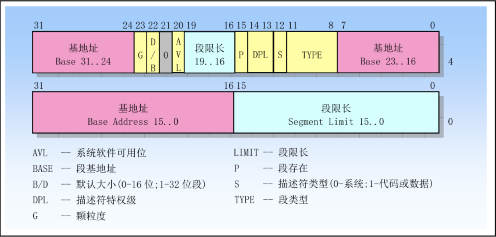
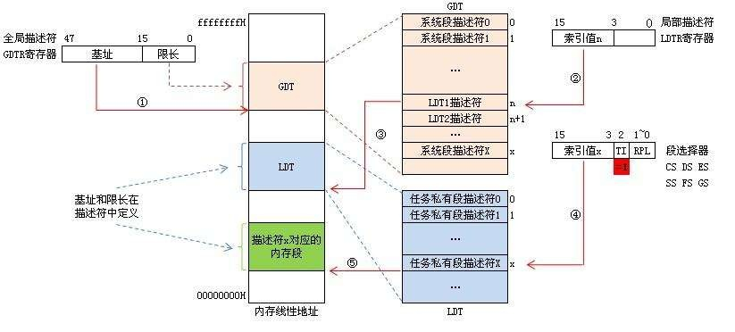

# 进入保护模式

## 实模式下的一些问题？

1. 实模式下操作系统和用户程序属于同一特权级，没有区别

2. 逻辑地址就是物理地址

3. 用户程序可以修改段基址，内存所有地址都能够访问到

4. 20根地址线，最大内存1M, 太小

5. 一次只能运行一个程序

6. 实模式下采用：`物理地址 = 基础地址(段基址偏移4位) + 偏移地址`来访问内存，对x86`16`位寄存器最大是2^16=64KB，即当访问的内存超过64KB时，就要更改段基址了（即如果使用16bit段寄存器CS（Code Segment），DS（Data Segment），SS（Stack Segment）来指定段，CPU将段寄存器中的数值向左偏移4bit，放到20bit的地址总线上就成为20bit的Base Address，在加上偏移地址构成实际对物理地址）

因为这些问题，所以有了**保护模式**，保护模式可以做到如下：

1. 地址线32根，最大内存可以是4G
2. 32位寄存器，是可以访问到4G内存的

## 分段基础和如何分段

### 分段概述

80386/80486 CPU 共有3 种描述符表：全局描述符表(GDT)、局部描述符表(LDT)和中断描述符表(IDT)。描述符表由描述符顺序排列组成，占一定的内存，由系统地址寄存器(全局描述符表寄存器:GDTR 、局部描述符表寄存器:LDTR、中断描述符表寄存器:IDTR) 指示其在物理存储器中的位置和大小.

* 全局描述符表寄存器GDTR，48位寄存器
* 中断描述符表寄存器IDTR，48位寄存器
* 局部描述符表寄存器LDTR，16位寄存器

* GDT是全局描述表，主要存放操作系统和各任务公用的描述符，如公用的数据和代码段描述符、各任务的TSS描述符和LDT描述符。（TSS是任务状态段，存放各个任务私有运行状态信息描述符）
* LDT是局部描述符表，主要存放各个任务的私有描述符，如本任务的代码段描述符和数据段描述符等(在分页机制出现以前的操作系统中并没有虚拟内存（Virtual Memory）这个概念;为了让不同程序的数据彼此互不干扰，x86架构引入了LDT概念，期望操作系统可以通过为不同的应用程序设置不同的LDT而隔离程序间的数据。)

---

保护模式下的段寄存器 由 16位的选择器 与 64位的段描述符寄存器 构成

原先实模式下的各个段寄存器作为保护模式下的段选择器，80486中有6个(即CS,SS,DS,ES,FS,GS)段寄存器。由选择器CS对应表示的段仍为代码段，选择器SS对应表示的段仍为堆栈段。

* 这些16bit的段寄存器也成为**段选择子**（Selector），描述如下


* 描述符索引——用来在描述符表中选择一个段描述符,2^13=8196个段（系统中就是8196个段描述符）
* 描述符表指示器——TI=0时，在GDT表中；TI=1时，在LDT表中
* 请求特权级别——4个级别，0，1，2，3

### 如何分段

* 首先,保护模式下使用`分段`模式，访问一个内存地址仍然使用**Segment:Offset**的方式，不过要能支持访问到32bit的地址，即4GB内存

* 其次，段访问提供了保护机制，也就说一个段的描述符中需要规定对自身的访问权限（Access）。所以，在保护模式下，对一个段的描述则包括3方面因素：`[Base Address, Limit, Access]`，它们加在一起被放在一个64bit(8字节)长的数据结构中，即为**段描述符**



1. 基地址Base Address分散在这64bit中，整体是32bit的，即确保了能访问整个4GB内存
2. 描述符类型标志S，可以描述段类型：系统段，数据段，代码段等
3. 段限长Limit分散在这64bit中，整体是20bit的，当颗粒度G=0时，Limit值的单位是B，即Limit的范围可以是1B到1MB；当G=1，则Limit值的单位是4KB，即Limit的范围可以是4KB到4GB，即确保了能访问整个4GB内存
4. GDTR寄存器48bit，32bit描述了在GDT在内存中的起始地址(GDT存放在内存中的某个任意位置，通过GDTR的这32bit先定位到在内存那里，然后才能定位到具体的段描述符号)；16bit限长（2^16=65536)(8196个段描述符 * 每个段描述符是8字节，2^13 * 2^3 = 2^16)，所以<font color='red'>16bit限长，13bit索引，8196个段描述符，段描述符大小是8字节，这些都是完美的设计数字</font>

### 物理内存如何确定



段寄存器的TI=1的内存访问：
   1. 先从全局描述符表寄存器(GDTR)寄存器(48位,其中前32位base+16位长度)中获得全局描述符表(GDT)基址
   2. 从LDTR寄存器中获取LDT所在段的位置索引(LDTR的高13位)
   3. 根据1，2确定GDT中具体的段描述符，即定位到具体的LDT段基址
   4. 由段选择子的高13位位置索引值再从LDT段中定位到具体LDT段描述符
   5. 段描述符中包含段的基址、限长、优先级等各种属性；这就得到了段的起始地址（基址），再加上偏移地址，就能得到最终的物理内存地址

* 举例说明物理内存的定位

访问`ds:0x9`这样的内存

若选择子（段寄存器）的内容是:`0x8`，如下所示

```java
0000 0000 0000 1000

描述符索引值：0000 0000 0000 1，(结合TI, 则对应GDT中的第一个描述符）
TI: 0 (表示使用了GDT, 而非LDT)
RPL: 00
```

假设第一个段描述符的所有32bit的基址起来后的内容是`0x1234`，则段基址确定为:`0x1234`

最后访问的内存地址是`0x1234:0x9`，即`0x123d`

注意：选择子如果忘记初始化，那个将访问第0个描述符，所以GDT第0个描述符不可用。若选择到了第0个描述符，则处理器会发生异常。

## 本次分段代码讲解

代码见<a href="https://github.com/doctording/os/tree/master/docs/content/03_protected_mode/code" target="_blank">相应的code文件夹</a>

上一章节的代码若没有问题，这次`mbr.S`不需要修改，唯一的修改就是读入的扇区数要变大，原来只有一个第2扇区，现在利用磁盘读写第2,3,4,5四个扇区（这当然是可变的）。

需要弄清楚这4个扇区究竟存了些什么东西；显然要是保护模式，则需要有：GDT，段描述符，选择子等，内存不再是直接的“段基址：偏移量”直接访问了，而是通过段描述符定位基址，然后“基址：偏移量”访问

### boot.inc 分析

```cpp
;-------------  loader和kernel   ----------

LOADER_BASE_ADDR equ 0x900
LOADER_START_SECTOR equ 0x2

;--------------   gdt描述符属性  -------------
DESC_G_4K   equ	  1_00000000000000000000000b   
DESC_D_32   equ	   1_0000000000000000000000b
DESC_L	    equ	    0_000000000000000000000b	;  64位代码标记，此处标记为0便可。
DESC_AVL    equ	     0_00000000000000000000b	;  cpu不用此位，暂置为0  
DESC_LIMIT_CODE2  equ 1111_0000000000000000b
DESC_LIMIT_DATA2  equ DESC_LIMIT_CODE2
DESC_LIMIT_VIDEO2  equ 0000_000000000000000b
DESC_P	    equ		  1_000000000000000b
DESC_DPL_0  equ		   00_0000000000000b
DESC_DPL_1  equ		   01_0000000000000b
DESC_DPL_2  equ		   10_0000000000000b
DESC_DPL_3  equ		   11_0000000000000b
DESC_S_CODE equ		     1_000000000000b
DESC_S_DATA equ	  DESC_S_CODE
DESC_S_sys  equ		     0_000000000000b
DESC_TYPE_CODE  equ	      1000_00000000b	;x=1,c=0,r=0,a=0 代码段是可执行的,非依从的,不可读的,已访问位a清0.  
DESC_TYPE_DATA  equ	      0010_00000000b	;x=0,e=0,w=1,a=0 数据段是不可执行的,向上扩展的,可写的,已访问位a清0.

DESC_CODE_HIGH4 equ (0x00 << 24) + DESC_G_4K + DESC_D_32 + DESC_L + DESC_AVL + DESC_LIMIT_CODE2 + DESC_P + DESC_DPL_0 + DESC_S_CODE + DESC_TYPE_CODE + 0x00
DESC_DATA_HIGH4 equ (0x00 << 24) + DESC_G_4K + DESC_D_32 + DESC_L + DESC_AVL + DESC_LIMIT_DATA2 + DESC_P + DESC_DPL_0 + DESC_S_DATA + DESC_TYPE_DATA + 0x00
DESC_VIDEO_HIGH4 equ (0x00 << 24) + DESC_G_4K + DESC_D_32 + DESC_L + DESC_AVL + DESC_LIMIT_VIDEO2 + DESC_P + DESC_DPL_0 + DESC_S_DATA + DESC_TYPE_DATA + 0x0b

;--------------   选择子属性  ---------------
RPL0  equ   00b
RPL1  equ   01b
RPL2  equ   10b
RPL3  equ   11b
TI_GDT	 equ   000b
TI_LDT	 equ   100b
```

将如下的地址对应到段描述符的高32位中的0-23位

* G位: G=1 代表段基址的粒度是4KB

```java
DESC_G_4K   equ	  1_00000000000000000000000b
```

* D位:分D和B: 1是D,代表数据段;0是B，代表堆栈段

```java
DESC_D_32   equ	   1_0000000000000000000000b
```

* type


* 选择子属性，选择子定义在`loader.S`中：16位，可以索引到具体的段描述符

### 全局描述符表(GDT)的构造

* 定义4个段描述符

```cpp
;构建gdt及其内部的描述符
   GDT_BASE:   dd    0x00000000
	       dd    0x00000000

   CODE_DESC:  dd    0x0000FFFF
	       dd    DESC_CODE_HIGH4

   DATA_STACK_DESC:  dd    0x0000FFFF
		     dd    DESC_DATA_HIGH4

   VIDEO_DESC: dd    0x80000007	       ;limit=(0xbffff-0xb8000)/4k=0x7
	       dd    DESC_VIDEO_HIGH4  ; 此时dpl已改为0
```

GDT的第0个段不可用，剩下三个段描述符：代码段，堆栈段，显存段；（注：段描述符 64bit = 8B(dd是4字节，所以用两个dd定义一个段描述符)

实模式下内存地址`0xb8000`到`0xbffff`是显示适配器BIOS所在区域，当段粒度是4k时，段界限大小为`0xbffff-0xb800/4k` = 7, 所以段界限设为7，就足够表示显示的整个内存区域了

* 构造段寄存器内容即**选择子**（16位，可以索引到段描述符，13位索引+1位TI+2位RPL）

```java
SELECTOR_CODE equ (0x0001<<3) + TI_GDT + RPL0  ; 相当于(CODE_DESC - GDT_BASE)/8 + TI_GDT + RPL0

SELECTOR_DATA equ (0x0002<<3) + TI_GDT + RPL0  ; 同上

SELECTOR_VIDEO equ (0x0003<<3) + TI_GDT + RPL0  ; 同上
```

三个选择子的内容分别是（注意索引0是没有用的，这里三个索引1,2,3），都访问GDT而非LDT, 请求特权级都是0级

```java
0000000000000   00  0
1   TI_GDT  RPL0
2   TI_GDT  RPL0
3   TI_GDT  RPL0
```

## 实模式到保护模式的设置和跳转

进入保护模式，需要设置控制寄存器的cr0寄存器，其pe位置1，8686要打开A20，这些都在实模式完成，实模式也会设置GDT

```cpp
lgdt [gdt_ptr]
```

GDT由`gdtr寄存器`加载(gdtr共48bit=6B,前16bit界限，后32bit是起始地址)

```java
GDT_SIZE   equ   $ - GDT_BASE
GDT_LIMIT   equ   GDT_SIZE -	1
times 60 dq 0					 ; 此处预留60个描述符的slot
SELECTOR_CODE equ (0x0001<<3) + TI_GDT + RPL0         ; 相当于(CODE_DESC - GDT_BASE)/8 + TI_GDT + RPL0
SELECTOR_DATA equ (0x0002<<3) + TI_GDT + RPL0	 ; 同上
SELECTOR_VIDEO equ (0x0003<<3) + TI_GDT + RPL0	 ; 同上

;以下是定义gdt的指针，前2字节是gdt界限，后4字节是gdt起始地址

gdt_ptr  dw  GDT_LIMIT
    dd  GDT_BASE
```

## 保护模式代码执行

```java
p_mode_start:
   mov ax, SELECTOR_DATA
   mov ds, ax
   mov es, ax
   mov ss, ax
   mov esp,LOADER_STACK_TOP
   mov ax, SELECTOR_VIDEO
   mov gs, ax

   mov byte [gs:160], 'P'

   jmp $
```

首先选择子加载到各个段寄存器，其中`0xb8000-0xbfff`这个是显示适配器BIOS所在区域，将`SELECTOR_VIDEO`段加载到了gs,也即`0xb8000-0xbfff`这块内存加载到gs，那么操作gs写入数据，文本就能正常显示到屏幕了

按照上一节操作运行后得到的截图， 实模式和保护模式都能显示文本


