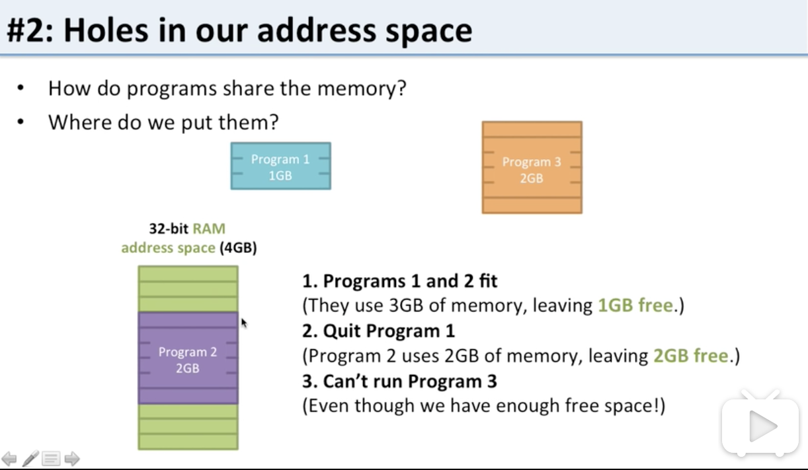
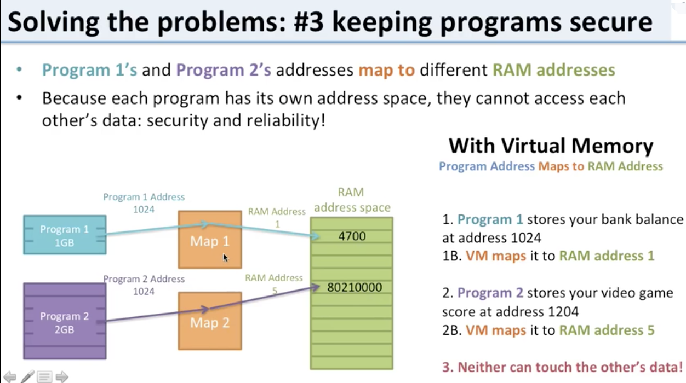

# 虚拟内存

参考学习：《computer architecture》

## 没有虚拟内存面临的问题

### 1. 没有足够内存

程序是可以访问到32bit的4G内存的任意位置的，但是如果物理内存没有4GB，比如只有1GB（事实上，即便有4GB内存，由于内核会占用一定内存，所以留给用户的内存也没有4GB，可能只有2GB可以给用户进程用）；所以这就导致访问超过1GB内存的时候，直接`Crash`了

### 2. 内存空洞(内存碎片问题)

进程是需要连续的内存空间的，即便整体可用内存足够，但是由于是都是空洞，不连续，这样也没法让进程跑起来

### 3. 进程隔离和安全问题

不同的进程会访问同一个内存地址，这回导致进程相互影响，直接`crash`；显然进程如果没能隔离，可靠性和安全性基本无法保证

## 虚拟内存如何解决上面的问题

### 解决问题1

illusion: n.错误的观念; 幻想; 幻想的事物; 错觉;

利用磁盘交换，内存不断的交换使用,给进程造成无限内存的错觉

### 解决问题2

虚拟内存是映射到物理内存的，所以利用map可以映射到任意的物理内存，内存空洞/碎片问题将不再成为问题

### 解决问题3

虚拟内存map映射可以完美的解决程序的隔离性问题，如果映射到相同物理地址，则可以任务是进程共享的内容，否则可以映射到不同的物理内存，确保某个进程不会影响其它进程的数据

## Page Fault

* VA：Virtual Address 虚拟地址
* PA：Physical Address 物理地址
* MMU：Memory Manage Unit 内存管理单元
* TLB：Translation Lookaside Buffer 旁路快表缓存/地址变换高速缓存
* PTE：Page Table Entry 分页表项

* CPU MMU

VA到PA的转换流程

1. 当CPU给MMU传新虚拟地址之后，MMU先去问TLB那边有没有，如果有就直接拿到物理地址发到总线给内存，开始工作
2. TLB容量比较小，难免发生Cache Miss，这时候MMU还有保底的老武器页表 Page Table，在页表中找到之后MMU除了把地址发到总线传给内存，还把这条映射关系给到TLB，让它记录一下刷新缓存
3. TLB容量不满的时候就直接把新记录存储了，当满了的时候就开启了淘汰大法把旧记录清除掉，来保存新记录
4. 如果CPU给MMU的虚拟地址在TLB和Page Table都没有找到对应的物理页帧或者权限不对，该怎么办呢？即有：page fault

* Page Fault：假如目标内存页在物理内存中没有对应的页帧或者存在但无对应权限，CPU 就无法获取数据，这种情况下CPU就会报告一个缺页错误；这是一个由硬件中断触发的可以由软件逻辑纠正的错误

### page fault类型

* Hard Page Fault 也被称为Major Page Fault，翻译为硬缺页错误/主要缺页错误，这时物理内存中没有对应的页帧，需要CPU打开磁盘设备读取到物理内存中，再让MMU建立VA和PA的映射。
* Soft Page Fault 也被称为Minor Page Fault，翻译为软缺页错误/次要缺页错误，这时物理内存中是存在对应页帧的，只不过可能是其它进程调入的，发出缺页异常的进程不知道而已，此时MMU只需要建立映射即可，无需从磁盘读取写入内存，一般出现在多进程共享内存区域。
* Invalid Page Fault 翻译为无效缺页错误，比如进程访问的内存地址越界访问，又比如对空指针解引用内核就会报segment fault错误中断进程直接挂掉。

### 导致Page Fault的一些场景

* 非法操作访问越界 这种情况产生的影响也是最大的，也是Coredump的重要来源，比如空指针解引用或者权限问题等都会出现缺页错误。
* 使用malloc新申请内存 malloc机制是延时分配内存，当使用malloc申请内存时并未真实分配物理内存，等到真正开始使用malloc申请的物理内存时发现没有才会启动申请，期间就会出现Page Fault。
* 访问数据被swap换出 物理内存是有限资源，当运行很多进程时并不是每个进程都活跃，对此OS会启动内存页面置换将长时间未使用的物理内存页帧放到swap分区来腾空资源给其他进程，当存在于swap分区的页面被访问时就会触发Page Fault从而再置换回物理内存。

## 颠簸或抖动(thrashing)

thrash：v.(作为惩罚用棍子等) 抽打，连续击打; (使) 激烈扭动，翻来覆去; 彻底击败，重创(对手); n.快节奏重金属摇滚乐; 载歌载舞的聚会;

在更换页面时，如果更换页面是一个很快会被再次访问的页面，则再次缺页中断后又很快会发生新的缺页中断。整个系统的效率急剧下降，这种现象称为颠簸（抖动）；颠簸本质上是指频繁的页调度行为

内存颠簸的解决策略：
1. 如果是因为页面替换策略失误，可以修改替换算法来解决这个问题；
2. 如果是因为运行的程序太多，造成程序无法同时将所有频繁访问的页面调入内存，则要降低多道程序的数量。
3. 否则，还剩下两个办法：1终止该进程；2增加物理内存容量；
