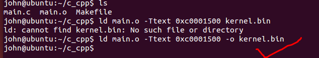
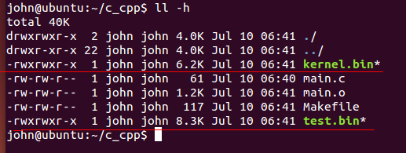
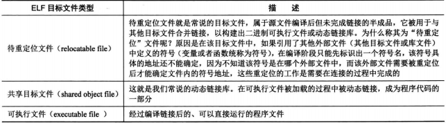
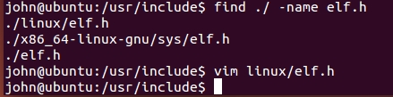
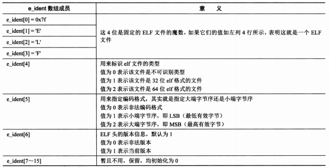

**需要理解c语言，汇编语言，指令，虚拟地址这些概念
进一步了解ELF文件格式**

---

* main.c
```
int main(void)
{
	while(1);
	return 0;
}
```

* 生成目标文件
```
$gcc -c -o main.o main.c
$john@ubuntu:~/c_cpp$ file main.o
main.o: ELF 64-bit LSB  relocatable, x86-64, version 1 (SYSV), not stripped
```

* 查看目标文件的符号
```
john@ubuntu:~/c_cpp$ nm main.o 
0000000000000000 T main
```
* 指定目标文件的起始虚拟地址
```
$ld main.o -Ttext 0xc0001500 -e main -o kernel.bin

-Ttext 指定可执行文件的起始虚拟地址
-e 指定可执行文件的起始地址（可以数字或符号）

```

不加-e会出现找不到入口符号(entry symbol)错误


_start是默认的入口符号

将main.c改成如下的,则没有问题
```
//int main(void)
int _start(void)
{
	while(1);
	return 0;
}
```



kernel.bin是可执行的文件
```
john@ubuntu:~/c_cpp$ file kernel.bin 
kernel.bin: ELF 64-bit LSB  executable, x86-64, version 1 (SYSV), statically linked, not stripped

```

手动编译的test.bin和ld链接的kernel.bin



小结：

* C语言编译出来的汇编语言，一般比直接汇编生成的体积要大，不过都是转成汇编再到机器指令，让cpu执行。C语言编译出来的汇编，加上了编译器的很多东西，但汇编后，仍然是我们熟悉的汇编格式的，所以用C语言写内核没有任何问题。

* 任何程序都要加载到内核才能运行，可以发现程序要有入口地址，这样就能被调用了，操作系统调用用户程序就是这样的，有了入口地址，简单的jmp 或者 call 指令就能去执行程序了。

---

把程序分成 **程序头** 和 **程序体**
程序头描述程序的元信息
程序体存储代码，数据等

拿到一个程序头，去解析它，就能得到该程序的所有信息了，执行它就行。
可以当成一种格式，一种协议，约定好就行了。这样程序的加载地址随意，给我头部信息就行了。

原来我们写操作系统，mbr,loader的地址都是固定的，这其实可以不那么固定.

header.S
```
header:
	program_length dd program_end-program_start
	start_addr dd program_start
;;;
body:
program_start:
	mov ax, 0x1234
	jmp $
program_end:

```

```
nasm -o header.bin header.S 
```

```
john@ubuntu:~/c_cpp$ xxd header.bin 
0000000: 0500 0000 0800 0000 b834 12eb fe         .........4...
john@ubuntu:~/c_cpp$ 
```

* 程序长度： 0x00 00 00 05
* 程序的起始地址：0x00 00 00 08
* b834 12eb fe
    * b8 3412 ==> mov eax 0x1234
    * ebfe ==> jmp $

文件格式===>elf也是一种格式，比起我们自定的格式要复杂而已

---

ELF格式的二进制文件



实例分析
```
john@ubuntu:~/c_cpp$ ls
header.bin  header.S  kernel.bin  main.c  main.o  Makefile  test.bin
john@ubuntu:~/c_cpp$ file kernel.bin 
kernel.bin: ELF 64-bit LSB  executable, x86-64, version 1 (SYSV), statically linked, not stripped
john@ubuntu:~/c_cpp$ 
```




elf头部信息

```
#define EI_NIDENT       16

typedef struct elf32_hdr{
  unsigned char e_ident[EI_NIDENT];
  Elf32_Half    e_type;
  Elf32_Half    e_machine;
  Elf32_Word    e_version;
  Elf32_Addr    e_entry;  /* Entry point */
  Elf32_Off     e_phoff;
  Elf32_Off     e_shoff;
  Elf32_Word    e_flags;
  Elf32_Half    e_ehsize;
  Elf32_Half    e_phentsize;
  Elf32_Half    e_phnum;
  Elf32_Half    e_shentsize;
  Elf32_Half    e_shnum;
  Elf32_Half    e_shstrndx;
} Elf32_Ehdr;

typedef struct elf64_hdr {
  unsigned char e_ident[EI_NIDENT];     /* ELF "magic number" */
  Elf64_Half e_type;
  Elf64_Half e_machine;
  Elf64_Word e_version;
  Elf64_Addr e_entry;           /* Entry point virtual address */
  Elf64_Off e_phoff;            /* Program header table file offset */
  Elf64_Off e_shoff;            /* Section header table file offset */
  Elf64_Word e_flags;
  Elf64_Half e_ehsize;
  Elf64_Half e_phentsize;
  Elf64_Half e_phnum;
  Elf64_Half e_shentsize;
  Elf64_Half e_shnum;
  Elf64_Half e_shstrndx;
} Elf64_Ehdr;


```


* e_ident数组（16字节）



观察二进制
```
0000000: 7f45 4c46 0201 0100 0000 0000 0000 0000  .ELF............
```
7f45 4c 46 表示 0x7f 'E' , 'L', 'F'

接下来02, 表示是64位的ELF文件

接下来01，表示编码格式是小端字节序（LSB）

再接着01，表示 EFI头版本，默认就是1

接下来都是0,保留用

与通过file命令看到的是一致的。

同理可以分析后面的内容，总之需要理解如下结点：

* 1. ELF文件是一种文件格式，可以被解析的

* 2. 程序（想想汇编语言）就是各种段（segment）和节(section)，当然还有数据，段和节的数量是不固定的，ELF文件会给出相关信息的


* 3. 程序有入口地址，各个段地址，这些都会被解析到内核中，这样一个程序能加载到内核中并运行

---

内核如何运行起来，相关概念和流程


首先我们把kernel.bin，写入磁盘

* 加载内核
把磁盘上的kernel文件加载到内存缓冲区（也就是读磁盘，加载到一块可用内存中）

* 初始化内核
内存中有了kernel（ELF格式的），
loader完成了分段，分页后，需要解析kernel文件，把它安置到相应的虚拟内存地址上去，这样直接跳转到此地址，然后loader结束，开始执行kernel。

* 内核映像，真正的内核

内核被加载内存后，一份是ELF文件，一份将是解析后的ELF文件(此才是可以执行的，此时内核映像)，内核映像就是将程序中的各种段(segment)复制到内存中的程序（有虚拟地址），这是真正的内核

---

附ELF文件的常见段：

* .text:存放代码（如：函数）和部分整数常量（应该指的是一些立即数）。这个段是只读的

* .data:用来存放初始化了的（initailized）全局变量（global）和初始化了的静态变量（static）。它是可读可写的

* .bss:全局变量数据段。它用来存放未初始化的（uninitailized）全局变量（global）和未初始化的静态变量（static）。它也是可读可写的。bss是英文Block Started by Symbol的缩写。之所以把bss跟data分开来，是因为系统会为这些bss段的变量的初值清零。

* .strtab : String Table 字符串表，用于存储 ELF 文件中用到的各种字符串。

* .symtab : Symbol Table 符号表，从这里可以所以文件中的各个符号。

* .shstrtab : 是各个段的名称表，实际上是由各个段的名字组成的一个字符串数组。

* .hash : 符号哈希表。

* .line : 调试时的行号表，即源代码行号与编译后指令的对应表。

* .dynamic : 动态链接信息。

* .debug : 调试信息。

* .comment : 存放编译器版本信息，比如 "GCC:(GNU)4.2.0"。

* .plt 和 .got : 动态链接的跳转表和全局入口表。

* .init 和 .fini : 程序初始化和终结代码段。

* .rodata1 : Read Only Data，只读数据段，存放字符串常量，全局 const 变量，该段和 .rodata 一样。