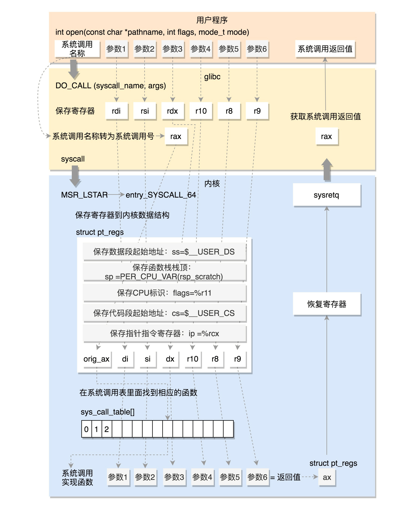

# 系统调用

操作系统对用户进程提供服务的接口
* 通过软中断触发中断
* INT和IRET指令用于系统调用，系统调用时，有堆栈切换和特权级的切换

系统调用简单流程
1. 当应用程序调用系统调用时，软中断触发0x80中断（要保护现场：如用户进程的值都保存到寄存器）
2. CPU收到中断信号，从中断向量表中，拿到中断服务例程，得到中断号
3. 通过中断号，从系统调用表中找到系统调用程序（用户无法访问的，内核的某个地址），然后开始执行（内核态就可以随心所欲操作了）
4. 执行完之后，再恢复现场，返回上层应用程序，用户进程接着运行

对系统调用的认识，至少要认识到如下两点：

* 系统调用涉及到用户态和内核态切换，是通过中断实现的
* 系统调用的成本比用户态的函数调用的成本高
