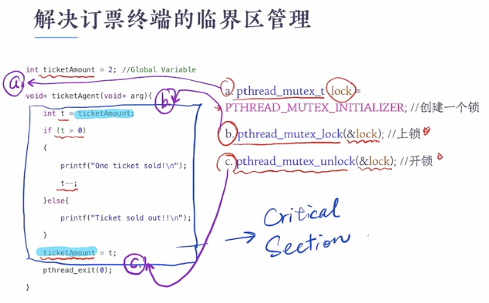

# Linux mutex

Operation-Systems designers build software tools to solve the critical-section problem. The simplest of these tools is the **mutex lock**.

* A process must acquire the lock before entering a critical section;
* It must release the lock when it exists the critical section.

进入临界区必须获取锁，其它线程必须等待；离开临界区必须要释放锁

进入和离开必须是**原子操作**（Atomic operations mean the operation can not be interrupted while it's running.）如硬件指令：test_and_set(), compare_and_swap()就是原子操作的

自旋操作：忙式等待，占用CPU执行空循环
* 缺点：占用CPU，浪费CPU周期
* 优点：没有上线文切换，多处理器系统中，那么可以在一个核中自旋，自旋更有优势

## pthread_mutex_t 的使用例子

