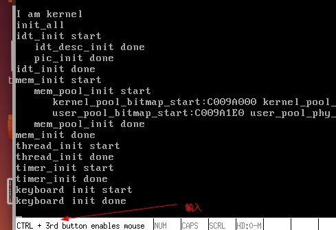
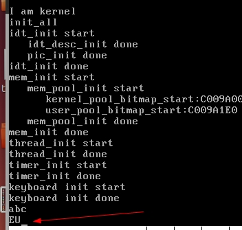

# 键盘输入

理解键盘输入，驱动程序概念即可

* 键盘输入

键盘是个独立的设备，在它内部有个叫作键盘编码器的芯片，通常是 Intel 8048 或兼容芯片，它的作用是：每当键盘上发生按键操作，它就向键盘控制器报告哪个键被按下，按键是否弹起。

这个键盘控制器可并不在键盘内部，它在主机内部的主板上，通常是 Intel 8042 或兼容芯片，它的作用是接收来自键盘编码器的按键信息，将其解码后保存，然后向中断代理发中断，之后处理器执行相应的中断处理程序读入 8042 处理保存过的按键信息。


**键盘扫描码**：按键·数值，键盘上的每一个键都有数值

一个键的状态要么是按下，要么是弹起，因此一个键便有两个编码，按键被按下时的编码叫**通码**，也就是表示按键上的触点接通了内部电路，使硬件产生了一个码，故通码也称为 makecode。按键在被按住不松手时会持续产生相同的码，直到按键被松开时才终止，因此按键被松开弹起时产生的编码叫**断码**，也就是电路被断开了，不再持续产生码了，故断码也称为 breakcode。**一个键的扫描码是由通码和断码组成的**

按键的表现行为是字符处理程序负责的，键盘的中断处理程序便充当了字符处理程序。 一般的字符处理程序使用字符编码来处理字符，比如 ASCII 码，因此我们可以在中断处理程序中将空格的扫描码 Ox39转换成 ASCII 码 Ox20，然后将 ASCII 码 Ox20 交给我们的 put_char 函数，将 ASCII 码写入显存，也就是输出到屏幕。因此，按下空格键可以在屏幕上输出一个空格，就是这么来的。

* 驱动程序

在计算机中，硬件是用软件来交互的，想让硬件做什么，必须通过软件的方式告诉它 。 硬件为方便软件对它的“调遣”，它为软件提供了接口，这通常是通过 IO 指令进行一堆复杂的寄存器设置，然后通过读取寄存器检测相应的状态，然后再进行数据交换 。 虽然这己大大方便了我们对硬件的控制，但我们依然是“懒惰的”，不希望每次找硬件帮忙时都做这种重复性的体力劳动，这种很“直白地”寄存器控制指令显然还方便得不够 。 我们不想要“过程”，只想要个“结果”。

为了方便获取“结果”，我们**将这些复杂的硬件控制指令封装成一个过程**，每次只把对破件的操作需求提交给此过程，由此过程实施底层的控制细节，然后返回给调用者一个结果，这个**直接同底层硬件打交道的过程便**是驱动程序 。

* 程序验证

```cpp
#include "init.h"
#include "print.h"
#include "interrupt.h"
#include "timer.h"
#include "memory.h"
#include "thread.h"
#include "console.h"
#include "keyboard.h"

/*负责初始化所有模块 */
void init_all() {
   put_str("init_all\n");
   idt_init();      // 初始化中断
   mem_init();      // 初始化内存管理系统
   thread_init();    // 初始化线程相关结构
   timer_init();     // 初始化PIT
   console_init();   //控制台初始化最好放在开中断之前
   keyboard_init();  // 键盘初始化
}

```

输入字符等进行键盘输入验证，查看效果




