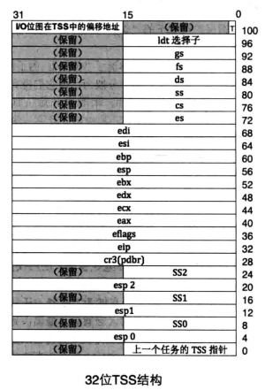
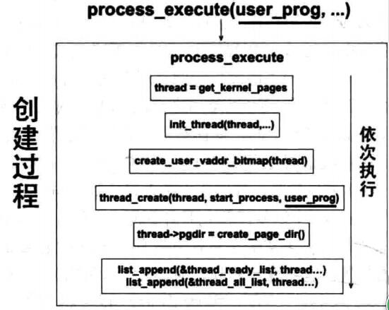
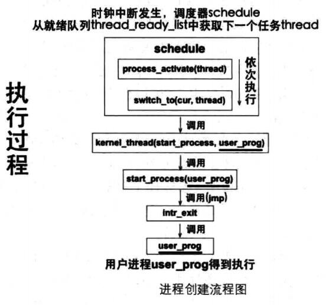
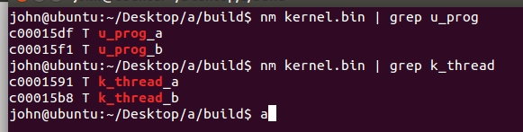

# 指令特权级&用户进程

* 用户进程的实现

* 特权级认识

* 用户进程与内核线程实现的区别

* 用户进程的数据结构，内存分布

## 特权级


* 从应用关系理解为什么有特权级别？

平时工作的文档等是某个**应用程序**的应用；

这个应用程序是**编译器**的应用

编译器是**操作系统**的应用

操作系统是**硬件**的应用

操作系统直接操作了硬件，操作系统能做什么取决于硬件提供的功能支持。操作系统最直接从操作就是CPU,CPU把CS和[E]IP指向的内容当成指令执行,把DS指向的内存当做普通数据（这是CPU规定好的，操作系统无法改变）

* LDT

LDT（局部描述符表）；GDT(全局描述符表)，里面存放用于全局的内存描述符。描述符的功能就是描述一段内存区域的作用和属性，是对应内存区域的身份证。

LDT是任务（程序被加载到内存中，称为映像，也称为任务）的私有数据结构，每个任务都有，位置不固定。

GDT: gdt寄存器存放描述符表的起始位置，加上偏移就能访问到某个内存区域了。

LDT：lgdt寄存器存放LDT局部地址，加上偏移

* TSS（任务状态段）

每个任务维持一个TSS，TSS存放任务的状态；任务切换是指就是切换不同的TSS，TSS信息存放在CPU的TR寄存器，TR寄存器指向不同的TSS,就是不同的任务切换。

TSS和其它段一样也是一片存储数据的内存区域，这段内存区域保存了任务的最新状态（也就是任务运行时占用的寄存器组等）

TSS结构如下，基本上全是寄存器，TSS有CPU“维护”



* CPU LDT TSS


TSS 和 LDT 都只能且必须在 GDT 中注册描述符，TR 寄存器中存储的是 TSS 的选择子， LDTR 寄存器中存储的是 LDT 的选择子， GDTR 寄存器中存储的是GDT 的起始地址及界限偏移

TSS 与其他普通段一样，也有自己的描述符，即TSS 描述符，用它来描述一个 TSS 的信息，此描述符需要定义在GDT中。寄存器 TR 始终指向当前任务的TSS 。任务切换就是改变 TR 的指向， CPU 自动将当前寄存器组的值（快照）写入 TR 指向的 TSS ，同时将新任务 TSS 中的各寄存器的值载入 CPU 中对应的寄存器，从而实现了任务切换。

## 任务切换

1. 通过“中断＋任务门”进行任务切换

2. call 或 jmp＋任务门

3. iretd

iretd 指令用于从中断处理例程中返回,两个功能

* 从中断返回到当前任务的中断前代码处。

* 当前任务是被嵌套调用时，它会调用自己 TSS 中“上一个任务的 TSS 指针”的任务，也就是返回到上一个任务 。

## 实现用户进程

### 内核中实现线程回顾

数据结构：

* 线程运行状态

```cpp
/* 进程或线程的状态 */
enum task_status {
   TASK_RUNNING,
   TASK_READY,
   TASK_BLOCKED,
   TASK_WAITING,
   TASK_HANGING,
   TASK_DIED
};
```

* 中断栈（用于保护上下文环境）

```cpp
/***********   中断栈intr_stack   ***********
 * 此结构用于中断发生时保护程序(线程或进程)的上下文环境:
 * 进程或线程被外部中断或软中断打断时,会按照此结构压入上下文
 * 寄存器,  intr_exit中的出栈操作是此结构的逆操作
 * 此栈在线程自己的内核栈中位置固定,所在页的最顶端
********************************************/
struct intr_stack {
    uint32_t vec_no;	 // kernel.S 宏VECTOR中push %1压入的中断号
    uint32_t edi;
    uint32_t esi;
    uint32_t ebp;
    uint32_t esp_dummy;	 // 虽然pushad把esp也压入,但esp是不断变化的,所以会被popad忽略
    uint32_t ebx;
    uint32_t edx;
    uint32_t ecx;
    uint32_t eax;
    uint32_t gs;
    uint32_t fs;
    uint32_t es;
    uint32_t ds;

/* 以下由cpu从低特权级进入高特权级时压入 */
    uint32_t err_code;		 // err_code会被压入在eip之后
    void (*eip) (void);
    uint32_t cs;
    uint32_t eflags;
    void* esp;
    uint32_t ss;
};
```

* 线程自己的栈

```cpp
/***********  线程栈thread_stack  ***********
 * 线程自己的栈,用于存储线程中待执行的函数
 * 此结构在线程自己的内核栈中位置不固定,
 * 用在switch_to时保存线程环境。
 * 实际位置取决于实际运行情况。
 ******************************************/
struct thread_stack {
   uint32_t ebp;
   uint32_t ebx;
   uint32_t edi;
   uint32_t esi;

/* 线程第一次执行时,eip指向待调用的函数kernel_thread 
其它时候,eip是指向switch_to的返回地址*/
   void (*eip) (thread_func* func, void* func_arg);

/*****   以下仅供第一次被调度上cpu时使用   ****/

/* 参数unused_ret只为占位置充数为返回地址 */
   void (*unused_retaddr);
   thread_func* function;   // 由Kernel_thread所调用的函数名
   void* func_arg;    // 由Kernel_thread所调用的函数所需的参数
};
```

* 线程控制块：线程信息，用于调度等

```cpp
/* 进程或线程的pcb,程序控制块 */
struct task_struct {
   uint32_t* self_kstack;	 // 各内核线程都用自己的内核栈
   enum task_status status;
   char name[16];
   uint8_t priority;
   uint8_t ticks;	   // 每次在处理器上执行的时间嘀嗒数

/* 此任务自上cpu运行后至今占用了多少cpu嘀嗒数,
 * 也就是此任务执行了多久*/
   uint32_t elapsed_ticks;

/* general_tag的作用是用于线程在一般的队列中的结点 */
   struct list_elem general_tag;				    

/* all_list_tag的作用是用于线程队列thread_all_list中的结点 */
   struct list_elem all_list_tag;

   uint32_t* pgdir;              // 进程自己页表的虚拟地址
   uint32_t stack_magic;	 // 用这串数字做栈的边界标记,用于检测栈的溢出
};
```

线程创建流程

```cpp
// 线程PCB
struct task_struct* thread = get_kernel_pages(1);

void thread_create(struct task_struct* pthread, thread_func function, void* func_arg);

void init_thread(struct task_struct* pthread, char* name, int prio);

struct task_struct* thread_start(char* name, int prio, thread_func function, void* func_arg);
```

### 用户进程

进程与内核线程的最大区别是：进程拥有独立的4G内存虚拟地址空间，虚拟地址空间连续而物理地址空间可以不用实现，所以进程数据结构比线程数据结构至少要有一个结构来存储4G虚拟地址空间

```cpp
uint32_t* pgdir;
```

用来保存进程页目录表的虚拟地址，这将在为进程创建页表时为其赋值

```cpp
/* 进程或线程的pcb,程序控制块 */
struct task_struct {
   uint32_t* self_kstack;	 // 各内核线程都用自己的内核栈
   enum task_status status;
   char name[16];
   uint8_t priority;
   uint8_t ticks;	   // 每次在处理器上执行的时间嘀嗒数

/* 此任务自上cpu运行后至今占用了多少cpu嘀嗒数,
 * 也就是此任务执行了多久*/
   uint32_t elapsed_ticks;

/* general_tag的作用是用于线程在一般的队列中的结点 */
   struct list_elem general_tag;				    

/* all_list_tag的作用是用于线程队列thread_all_list中的结点 */
   struct list_elem all_list_tag;

   uint32_t* pgdir;              // 进程自己页表的虚拟地址
   uint32_t stack_magic;	 // 用这串数字做栈的边界标记,用于检测栈的溢出
};
```

内核线程运行在特权级0，进程绝大时间都运行在特权级3；所以进程的栈和内核线程的栈所占用的内存地址需要有不同的特权级栈空间。

### 特权级0 到 特权级3

一般情况下，CPU不允许从高特权级转向低特权级，除非从中断和调用们返回。

实现用户进程

* 利用中断，iretd指令

* 必须提前准备好进程的栈结构，填充好用户进程的上下文信息，再适当时候pop进程信息，恢复进程运行环境

* 特权级存储在栈中的CS选择子RPL中，所以当其值为3时，CPU就知道进入的特权级为3

* RPL=CPL=3时，用户进程只能访问DPL为3的内存段，即代码段，数据段，栈段，所以栈中段寄存器的选择子必须指向DPL为3的内存段

* 对于可屏蔽中断来说，任务之所以能进入中断，是因为标志寄存器eflags中的IF位为1，退出中断还必须保持IF位为1，继续响应新的中断

* 用户进程特权级最低，对于IO操作，用户进程不能直接操作硬件控制，这是标志寄存器eflags中IOPL位决定的，所以实现用户进程必须使eflags的IOPL位为0





### 用户进程的内存空间分布

#### C程序内存空间分布


(1)代码段(text segment)：存放CPU执行的机器指令。通常代码段是可共享的，这使得需要频繁被执行的程序只需要在内存中拥有一份拷贝即可。代码段也通常是只读的，这样可以防止其他程序意外地修改其指令。另外，代码段还规划了局部数据所申请的内存空间信息。

代码段（code segment/text segment）通常是指用来存放程序执行代码的一块内存区域。这部分区域的大小在程序运行前就已经确定，并且内存区域通常属于只读, 某些架构也允许代码段为可写，即允许修改程序。在代码段中，也有可能包含一些只读的常数变量，例如字符串常量等。

(2)数据段(data segment)：或称全局初始化数据段/静态数据段(initialized data segment/data segment)。该段包含了在程序中明确被初始化的全局变量、静态变量(包括全局静态变量和局部静态变量)和常量数据。

(3)未初始化数据段：亦称BSS(Block Started by Symbol)。该段存入的是全局未初始化变量、静态未初始化变量。
而当程序被加载到内存单元时，则需要另外两个域：堆域和栈域。

(4)栈段(stack)：存放函数的参数值、局部变量的值，以及在进行任务切换时存放当前任务的上下文内容。
(5)堆段(heap)：用于动态内存分配，即使用malloc/free系列函数来管理的内存空间。

在将应用程序加载到内存空间执行时，操作系统负责代码段、数据段和BSS段的加载，并将在内存中为这些段分配空间。栈段亦由操作系统分配和管理，而不需要程序员显示地管理；堆段由程序员自己管理，即显示地申请和释放空间。

#### 附：虚拟空间映射


#### C程序为什么进行分段？

在保护模式下对内存的访问必须要经过段描述符，段描述符用来描述一段内存区域的访问属性，其中的S位和TYPE位可以组合成多种权限属性，处理器用这些属性来限制程序对内存的使用。

对于c程序来说，可以分为如下3个段

1. 可读写的数据，如数据节.data和未初始化.bss

2. 只读可执行的代码，如代码节.text和初始化代码节.init

3. 只读数据，如只读数据节.rodata,一般情况下字符串存放在此

**这将方面操作系统对程序的加载；便于安全检查**

如果程序对某片内存的访问方式不符合该内存所对应的段描述符（由访问内存时使用的选择子决定）中设置的权限，比如对代码这种具备只读属性的内存区域执行了写操作，处理器会检查到这种情况井抛出GP 异常。程序必须要加载到内存中才能执行，为了符合安全检查，程序中不同属性的节必须要放置到合适的段描述符指向的内存中。

比如为程序中具有只读可执行的指令部分所分配的内存，最好是通过具有只读、可执行属性的段描述符来访问，否则若通过具有可写属性的段描述符来访问指令区域的话，程序有可能会将自己的指令部分改写，从而引起破坏。

关于用户进程的调度仍然采用了内核线程的调度方法，具体查看：https://github.com/doctording/os/tree/master/11_thread_schedule

* 在未实现文件系统前，kernel.bin的实现方式如下

`磁盘文件 --》 载入内存 --》 解析ELF文件 --》 分配程序内存 --》 执行`

main.c

```cpp
#include "print.h"
#include "init.h"
#include "thread.h"
#include "interrupt.h"
#include "console.h"
#include "process.h"

void k_thread_a(void*);
void k_thread_b(void*);
void u_prog_a(void);
void u_prog_b(void);
int test_var_a = 0, test_var_b = 0;

int main(void) {
   put_str("I am kernel\n");
   init_all();

   thread_start("k_thread_a", 31, k_thread_a, "argA ");
   thread_start("k_thread_b", 31, k_thread_b, "argB ");
   process_execute(u_prog_a, "user_prog_a");
   process_execute(u_prog_b, "user_prog_b");

   intr_enable();
   while(1);
   return 0;
}

/* 在线程中运行的函数 */
void k_thread_a(void* arg) {
   char* para = arg;
   while(1) {
      console_put_str(" v_a:0x");
      console_put_int(test_var_a);
   }
}

/* 在线程中运行的函数 */
void k_thread_b(void* arg) {
   char* para = arg;
   while(1) {
      console_put_str(" v_b:0x");
      console_put_int(test_var_b);
   }
}

/* 测试用户进程 */
void u_prog_a(void) {
   while(1) {
      test_var_a++;
   }
}

/* 测试用户进程 */
void u_prog_b(void) {
   while(1) {
      test_var_b++;
   }
}
```

* 生成二进制的kernerl.bin 加载到了内存的0xc001500位置，通过 nm 命令查看里面的线程，进程地址



* bochs直接运行后，进程a,b正常运行，可以看到变量test_var_b不断的+


* bochs运行后 `lb 0xc00015df` 使程序暂停在进程a的位置


cs:0x002b

---

特权级有3 种：CPL,DPL 和RPL，每个都是有4个等级（0,1,2,3）。

一般来说，CPL 代表当前代码段的权限，如果它想要去访问一个段或门，首先要看看对方的权限如何，也就是检查对方的DPL，如果满足当前的权限比要访问的权限高，则有可能允许去访问，有些情况我们还要检查选择子的权限，即RPL,因为我们通过选择子:偏移量的方式去访问一个段，这算是一个访问请求动作，因此称为请求访问权限RPL(Requst Privilege Level)。当请求权限也满足条件，那么访问就被允许了。

RPL 是通过选择子的低两位来表现出来的(这么说来，CS 和SS 也是存放选择子的，同时CPL存放在CS 和SS 的低两位上，那么对CS 和SS 来说，选择子的RPL=当前段的CPL)。处理器通过检查RPL 和CPL 来确认一个访问是否合法。

cs：0x002b (0000 0000 0010 1011) 最后两位是数字3，代表特权级是3，是用户进程。
