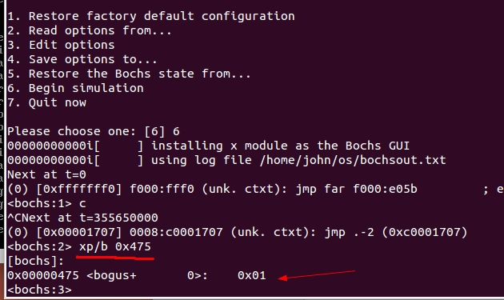
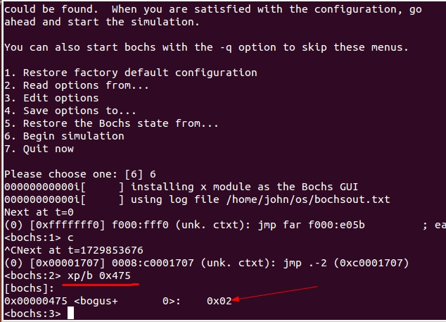
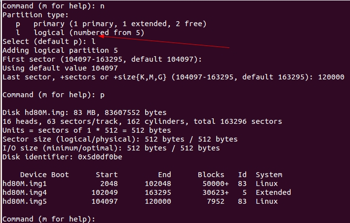
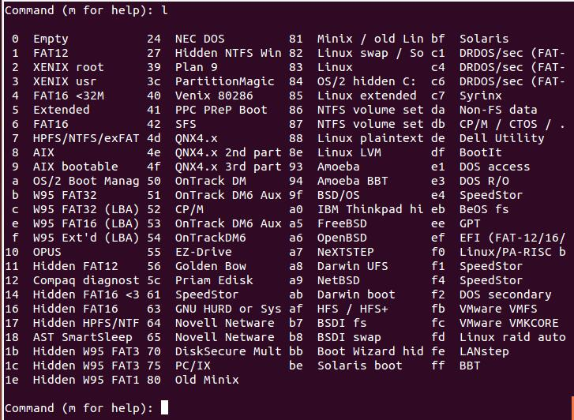
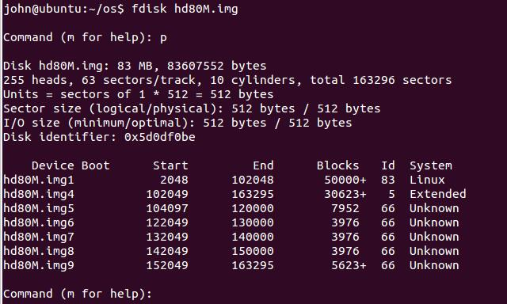
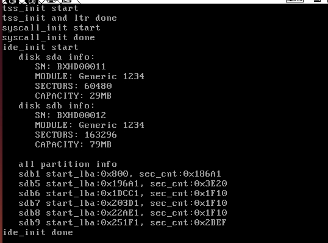

用户进程的实现

### bochs的bximage命令创建硬盘，BIOS识别


创建出的硬盘有格式，并且详细信息可以看到

*  柱面数 cyl=162
*  磁头数 heads=16
*  每磁道扇区数 sectors per track=63
*  总共的扇区数 total sectors=163296
*  总共大小 total size=79.73 megabytes


在bochs的配置文件中添加从盘hd80M.img

```
ata0-master: type=disk, mode=flat, path="/home/john/os/hd30M.img", cylinders=60, heads=16, spt=63
ata0-slave: type=disk, mode=flat, path="/home/john/os/hd80M.img", cylinders=162, heads=16, spt=63
```


* 在物理地址 Ox475 处存储着主机上安装的硬盘的数量，它是由 BIOS 检测并写入的，

bochs运行后，ctrl+c中断，然后使用xp命令查看

只有一个主磁盘



添加hd80M.img的从盘




---

### 磁盘相关概念

1. 硬盘容量＝单片容量×磁头数。

2. 单片容量＝每磁道扇区数×磁道数目×一个扇区大小。

扇区大小一般是512字节，扇区是硬盘读写的基本单位

磁盘读写很慢，因此操作系统不可能一次只写一个扇区，为了优化 1/0，操作系统把数据积攒到“多个扇区”时再一次性写入磁盘，这里的“多个扇区”就是指操作系统的**簇或块**。通常标准库函数还进行了二次优化，数据可以积攒到多个族或块时才写入，不过标准库中还提供了控制选项，可以立即把数据刷进硬盘。

以hd80M.img为例

```
*  柱面数 cyl=162
*  磁头数 heads=16
*  每磁道扇区数 sectors per track=63
*  总共的扇区数 total sectors=163296
*  总共大小 total size=79.73 megabytes
```

16（磁头数） * 162 （每个磁头的磁道数）* 63（m每个磁道的扇区数）* 512 （每个扇区的大小）= 83607552B 即 79.73MB

---

#### 分区

熟悉的磁盘分区格式:MBR, GPT

* 分区：人为地将硬盘上的柱面扇区划分成不同的分组，每个分组都是单独的分区。各分区都有“描述符”来描述分区本身所在硬盘上的起止界限等信息.

* MBR分区中有个 64 字节“固定大小”的数据结构，这就是著名的**分区表**，分区表中的每个表项就是一个分区的“描述符”，表项大小是 16 字节，因此 64 字节的分区表总共可容纳 4 个表项，这就是为什么MBR分区格式的硬盘仅支持 4 个分区的原因。


MBR (MainBootR四ord ）即主引导记录，它是一段引导程序，其所在的扇区称为主引导扇区，该扇区位于 0 盘。道 1 扇区（物理扇区编号从 1 开始，逻辑扇区地址 LBA 从 0 开始），也就是硬盘最开始的扇区，扇区大小为 512 宇节，这 512 字节内容由三部分组成。

1. 主引导记录 MBR 
2. 磁盘分区表 DPT 
3. 结束魔数 55AA ，表示此扇区为主引导扇区，里面包含控制程序

MBR引导程序位于主引导扇区中偏移 0～OxlBD 的空间，共计 446 字节大小，这其中包括硬盘参数及部分指令（由 BIOS 跳入执行），它是由分区工具产生的，独立于任何操作系统。

OxlBD-OxlFD 64字节就是磁盘分区表 DPT 

磁盘分区表（ Disk Partition Table ）简称 DPT，是由多个分区元信息汇成的表，表中每一个表项都对
应一个分区，主要记录各分区的起始扇区地址，大小界限等 。16字节内容如下


魔数 55AA 作为主引导扇区的有效标志，位于扇区偏移 OxlFE～OxI FF，也就是最后 2 个字节。

---

* 分区表共4个分区，那个分区作为扩展分区都可以，扩展分区是可选的，最多只能有一个；其余的都是主分区。扩展分区中的第一个逻辑分区的编号从5开始。


* 分区可以继续分成小的子分区,这就是逻辑分区，逻辑分区只存在扩展分区，他属于扩展分区的子集。

---

#### fdisk 分区实践

hd80M.img 空盘查看


设置磁盘的柱面数，磁头数


添加分区


根据扩展分区创建逻辑分区



保存分区信息


查看已知的文件系统id



设置分区的文件系统id


---

最后的磁盘信息如下



```
#usage: sh xxd.sh 文件 起始地址 长度 
xxd -u -a -g 1 -s $2 -l $3 $1 
```


16字节信息规定


第一个主分区
```
 00 
 00 
 21 
 02 
 83 （文件系统id）
 03 
 34 
 65 
 00 08 00 00 （ 分区起始偏移扇区 0x00000800）
 A1 86 01 00 ( 扇区总数 0x000186A1)
```

扩展分区
```
 00
 03 
 35 
 65 
 05 （文件系统id）
 0F 
 3F 
 A1 
 A1 8E 01 00 （ 分区起始偏移扇区 0x00018EA1 ）
 3F EF 00 00  ( 扇区总数 0x0000EF3F )
```

查看扩展分区

0x00018EA1*512 = 0x031D4200

```
sh xxd.sh hd80M.img 0x031D4200 512

```


扩展分区的第一个逻辑分区
```
00 
04
16 
67 
66 
00 
31 
77 
00 08 00 00 （ 分区起始偏移扇区 0x00000800,这个是相对扩展分区的，真正对整个磁盘的偏移扇区是 0x00018EA1 + 0x00000800 = 0x000196A1）
20 3E 00 00  ( 扇区总数 0x00003E20 )
```

#### 编写硬盘驱动程序

硬件是个独立的个体，它提供一套方法作为操作接口给外界调用，但此接口往往是最原始、最简陋、最繁琐的，相对咱们习惯的高级语言来说，这些接口使用起来非常麻烦，很多指令要提前设置好各种参数，基本上都是要用汇编语言来操作寄存器。

硬件是实实在在的东西，要想在软件中管理它们，只能从逻辑上抓住这些硬件的特性，将它们**抽象成一些数据结构**，然后这些数据结构便代表了硬件，用这些数据结构来组织硬件的信息及状态，在逻辑上硬件就是这数据结构。


驱动程序：

* 对硬件接口的封装，它把参数设置等重复、枯燥、复杂的过程封装成一个过程，避免每次执行命令时都重复做这些工作，根据需要也可以提供相关的策略，如缓存等，让硬件操作更加容易、省事、方便，无需再显式做一些底层设置。

* 没有驱动程序的话，操作系统也是可以同硬件交流的，无非是直接操作 IO 端口


硬盘基础回顾


硬盘当成一个IO设备，其有硬盘控制器（I/O接口）,就像显示器一样，其有显卡（也称为显示适配器），显存。

针对IDE硬盘，对其进行抽象
```
/* 硬盘结构 */
struct disk {
   char name[8];			   // 本硬盘的名称，如sda等
   struct ide_channel* my_channel;	   // 此块硬盘归属于哪个ide通道
   uint8_t dev_no;			   // 本硬盘是主0还是从1
   struct partition prim_parts[4];	   // 主分区顶多是4个
   struct partition logic_parts[8];	   // 逻辑分区数量无限,但总得有个支持的上限,那就支持8个
};

/* ata通道结构 */
struct ide_channel {
   char name[8];		 // 本ata通道名称, 如ata0,也被叫做ide0. 可以参考bochs配置文件中关于硬盘的配置。
   uint16_t port_base;		 // 本通道的起始端口号
   uint8_t irq_no;		 // 本通道所用的中断号
   struct lock lock;
   bool expecting_intr;		 // 向硬盘发完命令后等待来自硬盘的中断
   struct semaphore disk_done;	 // 硬盘处理完成.线程用这个信号量来阻塞自己，由硬盘完成后产生的中断将线程唤醒
   struct disk devices[2];	 // 一个通道上连接两个硬盘，一主一从
};
```

硬盘分区结构也进行抽象
```
/* 分区结构 */
struct partition {
   uint32_t start_lba;		 // 起始扇区
   uint32_t sec_cnt;		 // 扇区数
   struct disk* my_disk;	 // 分区所属的硬盘
   struct list_elem part_tag;	 // 用于队列中的标记
   char name[8];		 // 分区名称
   struct super_block* sb;	 // 本分区的超级块
   struct bitmap block_bitmap;	 // 块位图
   struct bitmap inode_bitmap;	 // i结点位图
   struct list open_inodes;	 // 本分区打开的i结点队列
};
```

```
/* 构建一个16字节大小的结构体,用来存分区表项 */
struct partition_table_entry {
   uint8_t  bootable;		 // 是否可引导	
   uint8_t  start_head;		 // 起始磁头号
   uint8_t  start_sec;		 // 起始扇区号
   uint8_t  start_chs;		 // 起始柱面号
   uint8_t  fs_type;		 // 分区类型
   uint8_t  end_head;		 // 结束磁头号
   uint8_t  end_sec;		 // 结束扇区号
   uint8_t  end_chs;		 // 结束柱面号
/* 更需要关注的是下面这两项 */
   uint32_t start_lba;		 // 本分区起始扇区的lba地址
   uint32_t sec_cnt;		 // 本分区的扇区数目
} __attribute__ ((packed));	 // 保证此结构是16字节大小

/* 引导扇区,mbr或ebr所在的扇区 */
struct boot_sector {
   uint8_t  other[446];		 // 引导代码
   struct   partition_table_entry partition_table[4];       // 分区表中有4项,共64字节
   uint16_t signature;		 // 启动扇区的结束标志是0x55,0xaa,
} __attribute__ ((packed));
```

---

硬盘和 CPU 是相互独立的个体，它们各自并行执行，但由于硬盘是低速设备，其在处理请求时往往消耗很长的时间,为避免浪费 CPU 资源，在等待硬盘操作的过程中最好把 CPU 主动让出来，让 CPU 去执行其他任务


```
/* 将buf中sec_cnt扇区数据写入硬盘 */
void ide_write(struct disk* hd, uint32_t lba, void* buf, uint32_t sec_cnt) {
   ASSERT(lba <= max_lba);
   ASSERT(sec_cnt > 0);
   lock_acquire (&hd->my_channel->lock);

/* 1 先选择操作的硬盘 */
   select_disk(hd);

   uint32_t secs_op;		 // 每次操作的扇区数
   uint32_t secs_done = 0;	 // 已完成的扇区数
   while(secs_done < sec_cnt) {
      if ((secs_done + 256) <= sec_cnt) {
	 secs_op = 256;
      } else {
	 secs_op = sec_cnt - secs_done;
      }

/* 2 写入待写入的扇区数和起始扇区号 */
      select_sector(hd, lba + secs_done, secs_op);

/* 3 执行的命令写入reg_cmd寄存器 */
      cmd_out(hd->my_channel, CMD_WRITE_SECTOR);	      // 准备开始写数据

/* 4 检测硬盘状态是否可读 */
      if (!busy_wait(hd)) {			      // 若失败
	 char error[64];
	 sprintf(error, "%s write sector %d failed!!!!!!\n", hd->name, lba);
	 PANIC(error);
      }

/* 5 将数据写入硬盘 */
      write2sector(hd, (void*)((uint32_t)buf + secs_done * 512), secs_op);

      /* 在硬盘响应期间阻塞自己 */
      sema_down(&hd->my_channel->disk_done);
      secs_done += secs_op;
   }
   /* 醒来后开始释放锁*/
   lock_release(&hd->my_channel->lock);
}
```

thread_yield 定义在也read.c 中，它的功能是主动把 CPU 使用权让出来，它与出thread_block 的区别是thread_yield 执行后任务的状态是 TASK_READY，即让出 CPU 后，它会被加入到就绪队列中，下次还能继续被调度器调度执行，而 thread_block 执行后任务的状态是 TASK_BLOCKED，需要被唤醒后才能加入到就绪队列 ， 所以下次执行还不知道是什么时候 。

---

```
/* 硬盘数据结构初始化 */
void ide_init() {
   printk("ide_init start\n");
   uint8_t hd_cnt = *((uint8_t*)(0x475));	      // 获取硬盘的数量
   ASSERT(hd_cnt > 0);
   list_init(&partition_list);
   channel_cnt = DIV_ROUND_UP(hd_cnt, 2);	   // 一个ide通道上有两个硬盘,根据硬盘数量反推有几个ide通道
   struct ide_channel* channel;
   uint8_t channel_no = 0, dev_no = 0; 

   /* 处理每个通道上的硬盘 */
   while (channel_no < channel_cnt) {
      channel = &channels[channel_no];
      sprintf(channel->name, "ide%d", channel_no);

      /* 为每个ide通道初始化端口基址及中断向量 */
      switch (channel_no) {
	 case 0:
	    channel->port_base	 = 0x1f0;	   // ide0通道的起始端口号是0x1f0
	    channel->irq_no	 = 0x20 + 14;	   // 从片8259a上倒数第二的中断引脚,温盘,也就是ide0通道的的中断向量号
	    break;
	 case 1:
	    channel->port_base	 = 0x170;	   // ide1通道的起始端口号是0x170
	    channel->irq_no	 = 0x20 + 15;	   // 从8259A上的最后一个中断引脚,我们用来响应ide1通道上的硬盘中断
	    break;
      }

      channel->expecting_intr = false;		   // 未向硬盘写入指令时不期待硬盘的中断
      lock_init(&channel->lock);		     

   /* 初始化为0,目的是向硬盘控制器请求数据后,硬盘驱动sema_down此信号量会阻塞线程,
   直到硬盘完成后通过发中断,由中断处理程序将此信号量sema_up,唤醒线程. */
      sema_init(&channel->disk_done, 0);

      register_handler(channel->irq_no, intr_hd_handler);

      /* 分别获取两个硬盘的参数及分区信息 */
      while (dev_no < 2) {
	 struct disk* hd = &channel->devices[dev_no];
	 hd->my_channel = channel;
	 hd->dev_no = dev_no;
	 sprintf(hd->name, "sd%c", 'a' + channel_no * 2 + dev_no);
	 identify_disk(hd);	 // 获取硬盘参数
	 if (dev_no != 0) {	 // 内核本身的裸硬盘(hd60M.img)不处理
	    partition_scan(hd, 0);  // 扫描该硬盘上的分区  
	 }
	 p_no = 0, l_no = 0;
	 dev_no++; 
      }
      dev_no = 0;			  	   // 将硬盘驱动器号置0,为下一个channel的两个硬盘初始化。
      channel_no++;				   // 下一个channel
   }

   printk("\n   all partition info\n");
   /* 打印所有分区信息 */
   list_traversal(&partition_list, partition_info, (int)NULL);
   printk("ide_init done\n");
}
```

运行截图



对比磁盘hd80M.img的信息，对比结果。