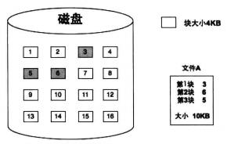
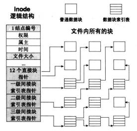
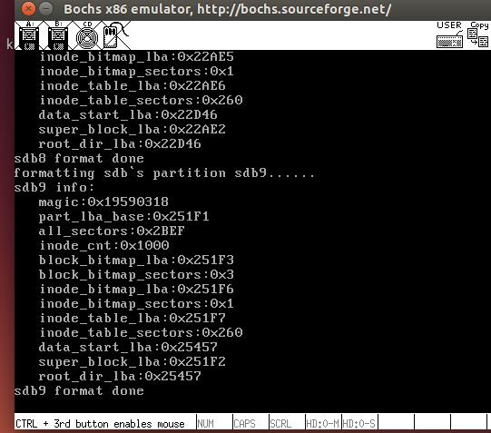
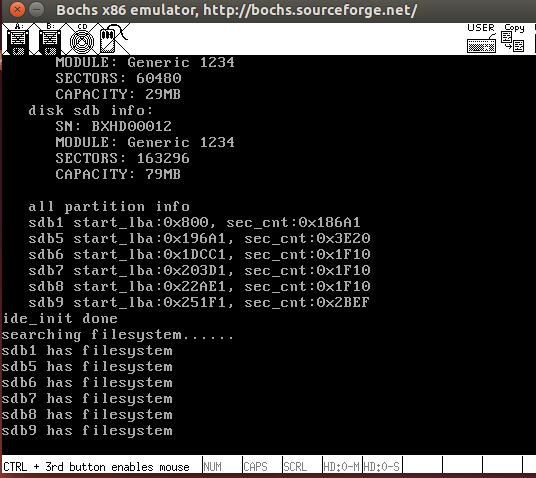

# 文件系统的实现

## 磁盘空间分配

硬盘是低速设备，其读写单位是扇区，为了避免频繁访问硬盘，操作系统不会有了一扇区数据就去读写一次磁盘，往往等数据积攒到“足够大小”时才一次性访问硬盘，这足够大小的数据就是**块**，一个块是由多个扇区组成的，块大小是扇区大小的整数倍。

块是文件系统的读写单位，因此文件至少要占据一个块，当文件体积大于 l 个块时，文件肯定被拆分成多个块来存储,多个块如何组织到一起--》磁盘空间分配方法

### 连续分配

连续分配要求每个文件在磁盘上占有一组连续的块。（块与块必需紧挨着）

#### 主要优点

* 可以直接访问文件

* 因为数据集中存放在连续的盘块中，访问时所需的寻道次数和寻道时间少。

#### 主要缺点

* 由于插入和删除记录会引起其它记录的移动，在外存中执行此操作会引起磁头的频繁来回移动，因此连续结构只能在文件的末尾插入记录，删除记录时，只作标记进行逻辑删除，只有用户指定物理删除时才真正删除相应记录，进行记录的移动；

* 顺序文件需要连续的盘块存放数据，因此，在插入记录时如果原来分配的盘块已没有空闲空间，而与其邻接的盘块也不空闲时，需要重新在外存中查找新的较大的空闲空间，并将原有数据移动到新空间中，然后才能插入新的数据，因此，连续结构不易动态增长，而且外存容易存在碎片。

### 链接分配


（类似链表，块与块位置任意的，每个块有个链接指针）

#### 主要优点

* 提高了磁盘空间利用率，解决了磁盘碎片问题；

* 便于文件的插入和删除操作；

* 便于文件的动态增长。

#### 主要缺点

* 只能有效的用于文件的顺序访问而不能有效的支持文件的直接访问。要找到文件的第i块，必须从文件的开始起，跟着指针，找到第i块。对指针的每次访问都需要读磁盘。

* 指针需要空间。每个文件需要比原来更多的空间。

* 可靠性问题，文件由指针链接的，指针分布于整个磁盘，如果指针丢失或损坏，可能导致链接空闲空间或另一个文件。

### 索引分配



（索引表，把链接分配的指针放到一起，形成一个索引地址数组）

链接分配解决了连续分配的外部碎片和大小声明问题，但是如果不用FAT，那么链接分配不能有效的支持直接访问。索引分配把所有指针放在一起，即通过索引块解决了这个问题。

对于大文件

* 多层索引
* 组合方案，结合链接索引

多层索引



#### 主要优点

* 支持直接访问

* 解决了磁盘碎片问题

* 文件修改方便：主要是对索引表的操作

#### 主要缺点

* 索引表占用了磁盘空间

## 目录，超级块

linux inode结构？

目录也是文件，也有inode； 目录是包含文件的文件，目录记录了其下的所有文件==》目录项

类似树结构，最开始的目录是 分区的“根目录 /”

例：


有了目录项后，通过文件名找文件实体数据块的流程

* 1 在目录中找到文件名所在的目录项 。
* 2 从目录项中获取 inode 编号 。
* 3 用 inode 编号作为 inode 数组的索引下标，找到 inode
* 4 从该 inode 中获取数据块的地址，读取数据块 。

### 超级块是保存文件系统元信息的元信息

超级块是文件系统元信息的“配置文件”，它是在为分区创建文件系统时创建的，所有有关文件系统元信息的配置都在超级块中，因此超级块的位置和大小不能再被“配置”了，必须是固定的，它被固定存储在各分区的第 2 个扇区，通常是占用一个扇区的大小，具体大小与实际文件系统类型为准。

例如一个 常见的磁盘文件系统布局


魔数用来确定文件系统的类型的标志，用它来区别于其他文件系统。

**根目录和空闲块区域**是真正用于存储数据的区域，除了这两部分，其他几个部分占用的扇区数取决于分区的容量大小，或者是在创建文件系统的过程中手动设置 。


### 创建文件系统

仍然是用数据结构抽象 超级块，inode,目录项等

数据块大小可以设定为1个扇区

```cpp
/* 超级块 */
struct super_block {
   uint32_t magic;		    // 用来标识文件系统类型,支持多文件系统的操作系统通过此标志来识别文件系统类型
   uint32_t sec_cnt;		    // 本分区总共的扇区数
   uint32_t inode_cnt;		    // 本分区中inode数量
   uint32_t part_lba_base;	    // 本分区的起始lba地址

   uint32_t block_bitmap_lba;	    // 块位图本身起始扇区地址
   uint32_t block_bitmap_sects;     // 扇区位图本身占用的扇区数量

   uint32_t inode_bitmap_lba;	    // i结点位图起始扇区lba地址
   uint32_t inode_bitmap_sects;	    // i结点位图占用的扇区数量

   uint32_t inode_table_lba;	    // i结点表起始扇区lba地址
   uint32_t inode_table_sects;	    // i结点表占用的扇区数量

   uint32_t data_start_lba;	    // 数据区开始的第一个扇区号
   uint32_t root_inode_no;	    // 根目录所在的I结点号
   uint32_t dir_entry_size;	    // 目录项大小

   uint8_t  pad[460];		    // 加上460字节,凑够512字节1扇区大小
} __attribute__ ((packed));
```

```cpp
/* inode结构 */
struct inode {
   uint32_t i_no;    // inode编号

/* 当此inode是文件时,i_size是指文件大小,
若此inode是目录,i_size是指该目录下所有目录项大小之和*/
   uint32_t i_size;

   uint32_t i_open_cnts;   // 记录此文件被打开的次数
   bool write_deny;	   // 写文件不能并行,进程写文件前检查此标识

/* i_sectors[0-11]是直接块, i_sectors[12]用来存储一级间接块指针 */
   uint32_t i_sectors[13];
   struct list_elem inode_tag;
};
```

```cpp
#define MAX_FILE_NAME_LEN  16	 // 最大文件名长度

/* 目录结构 */
struct dir {
   struct inode* inode;   
   uint32_t dir_pos;	  // 记录在目录内的偏移
   uint8_t dir_buf[512];  // 目录的数据缓存
};

/* 目录项结构 */
struct dir_entry {
   char filename[MAX_FILE_NAME_LEN];  // 普通文件或目录名称
   uint32_t i_no;		      // 普通文件或目录对应的inode编号
   enum file_types f_type;	      // 文件类型
};
```

创建文件系统就是创建文件系统所需要的元信息，这包括超级块位置及大小、 空闲块位图的位置及大小 、inode 位图的位置及大小 、 inode 数组的位置及大小、 空闲块起始地址、 根目录起始地址 。创建步骤如下：

* 1 根据分区 part 大小， 计算分区文件系统各元信息需要的扇区数及位置 。

* 2 在 内 存中 创建超级块，将以上步骤计算的元信息写入超级块。

* 3 将超级块写入磁盘。

* 4 将元信息写入磁盘上各自的位置。

* 5 将根目录写入磁盘

---

挂载分区

文件系统的主要工作是资源管理，跟踪资源的状态是通过位图来实现的，因此创建文件系统就是创建各种资源的位图，位图肯定是在内存中先创建好，然后再将位图持久化到硬盘，＂持久化”是指把数据写到可以长久保存信息的存储介质上，永远保存，比如磁盘就是一种持久化存储介质。

挂载分区前内存中可没有位图，这就需要事先把这些位图提前持久化到磁盘上，挂载分区时再把位图从硬盘上加载到内存。由于内存不能长久保存数据，断电之后内存中的一切都会灰飞烟灭，所以即使是将来挂载分区后，内存中的位图哪怕只是更改了一个位，都要及时同步持久化到磁盘上。

```cpp
/* 在磁盘上搜索文件系统,若没有则格式化分区创建文件系统 */
void filesys_init() {
   uint8_t channel_no = 0, dev_no, part_idx = 0;

   /* sb_buf用来存储从硬盘上读入的超级块 */
   struct super_block* sb_buf = (struct super_block*)sys_malloc(SECTOR_SIZE);

   if (sb_buf == NULL) {
      PANIC("alloc memory failed!");
   }
   printk("searching filesystem......\n");
   while (channel_no < channel_cnt) {
      dev_no = 0;
      while(dev_no < 2) {
	 if (dev_no == 0) {   // 跨过主盘
	    dev_no++;
	    continue;
	 }
	 struct disk* hd = &channels[channel_no].devices[dev_no];
	 struct partition* part = hd->prim_parts;
	 while(part_idx < 12) {   // 4个主分区+8个逻辑
	    if (part_idx == 4) {  // 开始处理逻辑分区
	       part = hd->logic_parts;
	    }
	 
	 /* channels数组是全局变量,默认值为0,disk属于其嵌套结构,
	  * partition又为disk的嵌套结构,因此partition中的成员默认也为0.
	  * 若partition未初始化,则partition中的成员仍为0. 
	  * 下面处理存在的分区. */
	    if (part->sec_cnt != 0) {  // 如果分区存在
	       memset(sb_buf, 0, SECTOR_SIZE);

	       /* 读出分区的超级块,根据魔数是否正确来判断是否存在文件系统 */
	       ide_read(hd, part->start_lba + 1, sb_buf, 1);   

	       /* 只支持自己的文件系统.若磁盘上已经有文件系统就不再格式化了 */
	       if (sb_buf->magic == 0x19590318) {
		  printk("%s has filesystem\n", part->name);
	       } else {			  // 其它文件系统不支持,一律按无文件系统处理
		  printk("formatting %s`s partition %s......\n", hd->name, part->name);
		  partition_format(part);
	       }
	    }
	    part_idx++;
	    part++;	// 下一分区
	 }
	 dev_no++;	// 下一磁盘
      }
      channel_no++;	// 下一通道
   }
   sys_free(sb_buf);
}
```

遍历磁盘，然后遍历磁盘上的分区，判断分区是否有文件系统，否则格式化成自己设定的文件系统。

#### 运行程序和测试

第一次运行会格式化磁盘，创建超级块，inode等



第二次运行时，由于第一次分区已经格式化有文件系统了，则会显示分区已有文件系统的信息


