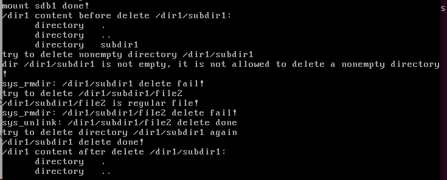

# 文件描述符

inode相关操作（目录，路径解析，文件检索）

## 文件描述符

内核（kernel）利用文件描述符（file descriptor）来访问文件。文件描述符是非负整数。打开现存文件或新建文件时，内核会返回一个文件描述符。读写文件也需要使用文件描述符来指定待读写的文件。该扇区，从而实现了文件的读写。几乎所有的操作系统都允许一个进程同时、多次、打开同一个文件（并不关闭），同样该文件也可以被多个不同的进程同时打开。

为实现文件任意位置的读写，执行读写操作时可以指定偏移量作为该文件内的起始地址，此偏移量相当于文件内的指针。

### 文件描述符与inode

读写文件的本质是 先通过文件的 inode 找到文件数据块的扇区地址，随后读写。

可以组织一个"文件数据结构"（包含文件偏移量，文件打开标志，inode指针等信息），方便对文件进行操作，即文件描述符。

在linux中每个进程都有单独的，完全相同的一套文件描述符，因此它们与其他进程的文件描述符互不干涉，这些文件描述符被组织成文件描述符数组进行统一的管理。

（每个进程在PCB（Process Control Block）中保存着一份文件描述符表，文件描述符就是这个表的索引，每个表项都有一个指向已打开文件的指针。）

Linux 通过文件描述符查找文件数据块

1. 进程PCB中有文件描述符数组
2. 文件表中存储了所有文件的结构（文件结构中有inode先关信息） -- 在内存中创建好的全局结构
3. 根据inode队列（inode缓存），找到最终的磁盘位置

## 文件 相关操作

创建普通文件 file_create 函数

### 创建普通文件需要考虑的工作

* 1) 文件需要 inode 来描述大小、位置等属性 ，所以创建文件就要创建其 inode 。这就涉及到向inode_bitmap 申请位图来获得 inode 号，因此 inode_bitmap 会被更新， inode_table 数组中的某项也会由新的 inode 填充 。

* 2) inode->i_sectors 是文件具体存储的扇区地址，这需要向 block_bitmap 申请可用位来获得可用的块（在我们这里，为简化处理， 1 块等于 1 扇区），因此 block_bitmap 会被更新，分区的数据区 data_start_lba
以后的某个扇区会被分配 。

* 3) 新增加的文件必然存在于某个目录，所以该目录的 inode->i_size 会增加一个目录项的大小(目录项存储文件名和i节点) 。 此新增加的文件对应的目录项需要写入该目录的 inode->i_sectors［］中的某个扇区，原有扇区可能己满，所以有可能要申请新扇区来存储目录项 。

* 4) 若其中某步操作失败，需要回滚到之前己成功的操作。

* 5) inode_bitmap 、 block_bitmap、新文件的 inode 及文件所在目录的 inode，这些位于内存中已经被改变的数据要同步到硬盘。

### 创建目录

创建目录所涉及的工作包括。
* 1) 确认待创建的新目录在文件系统上不存在。
* 2) 为新目录创建 inode 。
* 3) 为新目录分配 1 个块存储该目录中的目录项。
* 4) 在新目录中创建两个目录项"."和"..",这是每个目录都必须存在的两个目录项。
* 5) 在新目录的父目录中添加新目录的目录项。
* 6) 将以上资源的变更同步到硬盘。

**遍历目录**就是读取目录中所有的目录项，在遍历之前必须要先把目录打开，之后还需要把目录关闭。

**pwd**命令和**cd**命令： 每个目录都存储着当前目录和上一级目录，所以可以理论上可以访问到分区中所有的目录

### 文件和目录的创建，读写

代码见`19_fd_inode_dir_file\code\code_01`

```cpp
 printf("/dir1/subdir1 create %s!\n", sys_mkdir("/dir1/subdir1") == 0 ? "done" : "fail");
   printf("/dir1 create %s!\n", sys_mkdir("/dir1") == 0 ? "done" : "fail");
   printf("now, /dir1/subdir1 create %s!\n", sys_mkdir("/dir1/subdir1") == 0 ? "done" : "fail");
   int fd = sys_open("/dir1/subdir1/file2", O_CREAT|O_RDWR);
   if (fd != -1) {
      printf("/dir1/subdir1/file2 create done!\n");
      sys_write(fd, "Catch me if you can!\n", 21);
      sys_lseek(fd, 0, SEEK_SET);
      char buf[32] = {0};
      sys_read(fd, buf, 21); 
      printf("/dir1/subdir1/file2 says:\n%s", buf);
      sys_close(fd);
   }
```


### 目录的打开关闭

在文件，目录创建成功，并写入磁盘的基础上，测试目录的打开与关闭

```cpp
 struct dir* p_dir = sys_opendir("/dir1/subdir1");
   if (p_dir) {
      printf("/dir1/subdir1 open done!\n");
      if (sys_closedir(p_dir) == 0) {
	 printf("/dir1/subdir1 close done!\n");
      } else {
	 printf("/dir1/subdir1 close fail!\n");
      }
   } else {
      printf("/dir1/subdir1 open fail!\n");
   }
```


### 文件和目录的删除

```cpp
/********  测试代码  ********/
   printf("/dir1 content before delete /dir1/subdir1:\n");
   struct dir* dir = sys_opendir("/dir1/");
   char* type = NULL;
   struct dir_entry* dir_e = NULL;
   while((dir_e = sys_readdir(dir))) { 
      if (dir_e->f_type == FT_REGULAR) {
	 type = "regular";
      } else {
	 type = "directory";
      }
      printf("      %s   %s\n", type, dir_e->filename);
   }
   printf("try to delete nonempty directory /dir1/subdir1\n");
   if (sys_rmdir("/dir1/subdir1") == -1) {
      printf("sys_rmdir: /dir1/subdir1 delete fail!\n");
   }

   printf("try to delete /dir1/subdir1/file2\n");
   if (sys_rmdir("/dir1/subdir1/file2") == -1) {
      printf("sys_rmdir: /dir1/subdir1/file2 delete fail!\n");
   } 
   if (sys_unlink("/dir1/subdir1/file2") == 0 ) {
      printf("sys_unlink: /dir1/subdir1/file2 delete done\n");
   }
   
   printf("try to delete directory /dir1/subdir1 again\n");
   if (sys_rmdir("/dir1/subdir1") == 0) {
      printf("/dir1/subdir1 delete done!\n");
   }

   printf("/dir1 content after delete /dir1/subdir1:\n");
   sys_rewinddir(dir);
   while((dir_e = sys_readdir(dir))) { 
      if (dir_e->f_type == FT_REGULAR) {
	 type = "regular";
      } else {
	 type = "directory";
      }
      printf("      %s   %s\n", type, dir_e->filename);
   }

/********  测试代码  ********/
```


